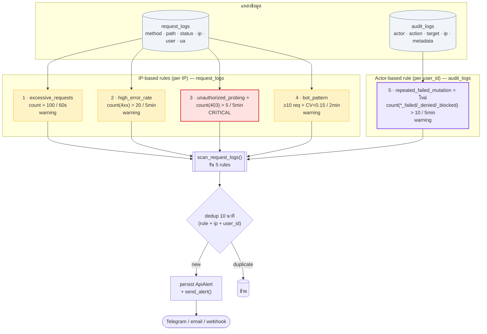
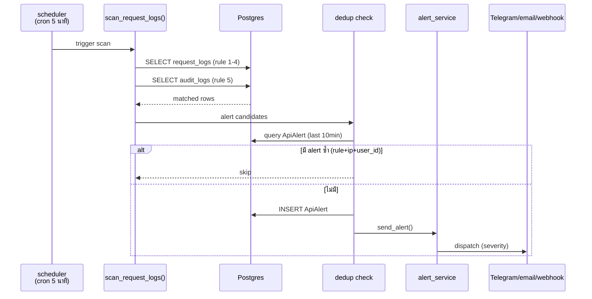

# api_guard — 5 กฎตรวจจับพฤติกรรมผิดปกติ

ระบบ scan logs หา pattern ที่ผิดปกติ → fire alert + persist `ApiAlert` + ส่ง webhook/email

**อ้างอิง:** [`hub/backend/app/services/api_guard.py`](../hub/backend/app/services/api_guard.py)

---

## ภาพรวม Flow



---

## ตารางเงื่อนไข

| # | Rule | แหล่ง | จัดกลุ่ม | เงื่อนไข | Window | Severity |
|---|---|---|---|---|---|---|
| 1 | **excessive_requests** | request_logs | IP | `count > 100` | 60s | warning |
| 2 | **high_error_rate** | request_logs (400-499) | IP | `count > 20` | 5min | warning |
| 3 | **unauthorized_probing** ⭐ | request_logs (403) | IP | `count > 5` | 5min | **critical** |
| 4 | **bot_pattern** | request_logs | IP | `≥10 req` + `CV < 0.15` | 2min | warning |
| 5 | **repeated_failed_mutation** ⭐ | audit_logs (`*_failed/_denied/_blocked%`) | **actor** | `count > 10` | 5min | warning |

---

## รายละเอียดแต่ละกฎ

### 1. excessive_requests (rate limit)
- **จับ:** DoS / scraper / API abuse
- **ข้อจำกัด:** ไม่แยก endpoint — load test ภายในอาจ trigger

### 2. high_error_rate (probing broad)
- **จับ:** fuzz endpoint / broken integration / scan
- **SQL:** `status_code >= 400 AND status_code < 500`

### 3. unauthorized_probing ⭐ critical
- **จับ:** privilege escalation attempt
- **ทำไม critical:** ระบบบอกชัดเจน "ห้าม" (403) แล้วยังพยายามต่อ
- **SQL:** `status_code = 403`

### 4. bot_pattern (interval analysis)
- **จับ:** สคริปต์ delay คงที่ — มนุษย์ interval ไม่สม่ำเสมอ
- **CV** = `stdev(intervals) / mean(intervals)` — บอท ≈ 0, มนุษย์ > 0.3

### 5. repeated_failed_mutation ⭐ ใหม่
- **จับ:** IDOR / enumeration / spam mutation (business level)
- **ครอบ action:** `subsystem_access_denied`, `delete_user_failed`,
  `whitelist_add_failed`, `subsystem_register_failed`, `user_access_denied`,
  `update_user_failed`, `risk_force_enroll_otp_failed`, `mfa_verify_failed`, …
- **ต่างจาก rule 1-4:** จัดกลุ่มตาม **actor (user_id)** — เห็นเจตนาที่ HTTP เห็นเป็น 404 ปกติ

---

## เปรียบเทียบ IP-based vs Actor-based

| | Rule 1-4 (IP) | Rule 5 (Actor) |
|---|---|---|
| แหล่ง | request_logs | audit_logs |
| จัดกลุ่ม | IP | login user (actor_id) |
| Level | HTTP (status code) | Business (action name) |
| จับ | rate / 4xx / 403 / interval | failure-path log (เจตนา) |
| ตัวอย่าง | สแกน endpoint รัวๆ | เดา user_id ลบ 11 ครั้ง (ทุกครั้ง 404) |

→ **complementary** ไม่ซ้ำซ้อน — rule 5 เห็นสิ่งที่ rule 1-4 มองข้าม

---

## Pipeline



---

## วิธีรัน Scan

| วิธี | จังหวะ |
|---|---|
| `api_guard_scheduler` | cron-based ใน background (default 5 นาที/ครั้ง) |
| `POST /admin/api-alerts/scan` | admin trigger เอง (manual) |

---

## ปรับ Threshold

แก้ที่ `RULES` dict ใน [`api_guard.py`](../hub/backend/app/services/api_guard.py):

```python
RULES["repeated_failed_mutation"]["threshold"] = 20   # หลวมขึ้น
RULES["unauthorized_probing"]["threshold"] = 10       # หลวมขึ้น
```

ไม่ต้องแก้ logic — แค่เปลี่ยนเลข → reload backend

---

## เคสตัวอย่างที่ rule 5 จับ

| สถานการณ์ | action ที่ log | จับเพราะ |
|---|---|---|
| developer เดา subsystem ของคนอื่น | `subsystem_access_denied` ×11 | IDOR attempt |
| admin spam ลบ user ID ปลอม | `delete_user_failed` ×11 | enumeration |
| spam ลงทะเบียน subsystem ผิด scope ซ้ำๆ | `subsystem_register_failed` | bot/script |
| ยิง whitelist add email ปลอมรัวๆ | `whitelist_add_failed` | enumeration email |

ทุกเคสที่ failure-path log ครอบไว้ → rule 5 จับต่อเองอัตโนมัติ

---

## Test

ดู [`tests/manual_repeated_failure_alert_driver.py`](../hub/backend/tests/manual_repeated_failure_alert_driver.py)
+ [`tests/reports/repeated_failure_alert_2026-06-15.md`](../hub/backend/tests/reports/repeated_failure_alert_2026-06-15.md)
(11/11 PASS)
