# บทที่ 3

# วิธีดำเนินงานและการออกแบบระบบ

---

# 3.1 บทนำ

บทนี้นำเสนอวิธีดำเนินงานและการออกแบบของระบบ **Central Auth Hub** หรือระบบจัดการสิทธิ์ผู้ใช้แบบศูนย์กลาง (Centralized Identity & Permission Management Platform) ซึ่งพัฒนาขึ้นเพื่อทำหน้าที่เป็นจุดศูนย์กลางในการพิสูจน์ตัวตน (Authentication) และกำหนดสิทธิ์การเข้าถึง (Authorization) ให้กับระบบย่อยหลายระบบของมหาวิทยาลัย โดยไม่ได้ออกแบบให้เป็น Single Sign-On (SSO) ในความหมายดั้งเดิม — แต่ละระบบย่อยยังคงมี session การเข้าสู่ระบบเป็นของตนเอง ขณะที่ Hub ทำหน้าที่เพียงยืนยันว่าผู้ใช้คนนี้เป็นใคร และมีสิทธิ์เข้าถึงระบบย่อยนั้นหรือไม่ ก่อนจะออก token ให้ระบบย่อยนำไปใช้ต่อ

ระบบที่พัฒนาขึ้นประกอบด้วยส่วนหลัก 4 ส่วน ได้แก่ (1) **Hub** ซึ่งเป็น Central Auth Server ที่ให้บริการ OAuth 2.0 / OpenID Connect พร้อมระบบ Passkey (WebAuthn/FIDO2) และระบบประเมินความเสี่ยงแบบ Risk-Based Authentication (RBA), (2) **Hub Admin Frontend** ซึ่งเป็น Next.js console สำหรับผู้ดูแลระบบ, (3) **ระบบย่อย 2 ระบบ** ได้แก่ ระบบหอพักและระบบห้องสมุด ซึ่งทำหน้าที่เป็น OAuth client ของ Hub และมีตรรกะทางธุรกิจของตนเอง และ (4) **ML Verifier** ซึ่งเป็นบริการแยกที่ใช้ Isolation Forest ร่วมกับ SHAP เพื่อให้คะแนนความผิดปกติของการเข้าสู่ระบบแต่ละครั้ง

ในด้านการพิสูจน์ตัวตน ระบบใช้ **Google OAuth** เป็น Identity Provider (IdP) หลัก โดยเชื่อมต่อผ่าน OIDC Discovery ด้วยไลบรารี Authlib สถาปัตยกรรมออกแบบให้สามารถเพิ่ม IdP อื่นได้ในอนาคตโดยไม่ต้องเปลี่ยนโครงสร้างหลัก เนื่องจาก Hub เป็น single point ที่เชื่อมต่อกับ IdP ระบบย่อยไม่ได้รู้จัก IdP โดยตรง นอกจากนี้ระบบยังรองรับการเข้าสู่ระบบแบบไม่ใช้รหัสผ่านด้วย **Passkey (WebAuthn)** ซึ่งพัฒนาเสร็จสมบูรณ์ครบทั้ง 8 เฟส ตั้งแต่การลงทะเบียนอุปกรณ์ การเข้าสู่ระบบ การจัดการอุปกรณ์ (เปลี่ยนชื่อ/เพิกถอน) ไปจนถึงการกู้คืนบัญชีด้วย backup code และ email OTP

ในด้านความปลอดภัย หัวใจของระบบคือกลไก **Hybrid Risk-Based Authentication แบบ 4 ชั้น** ที่ผสานกฎที่กำหนดไว้ล่วงหน้า (Rule Engine) การวิเคราะห์พฤติกรรมเฉพาะบุคคล (Behavior Profiling) แบบจำลอง Isolation Forest และตัวรวมคะแนน (Risk Aggregator) เข้าด้วยกัน เพื่อประเมินความเสี่ยงของการเข้าสู่ระบบแต่ละครั้งแบบ real-time และตัดสินใจว่าจะอนุญาตให้ผ่าน บังคับยืนยันตัวตนเพิ่มเติม (Step-Up / Re-Authentication) หรือปฏิเสธการเข้าสู่ระบบ โดยในช่วงต้นของการพัฒนาระบบทำงานใน **Shadow Mode** คือให้คะแนนและบันทึกผลโดยไม่บังคับจริง เพื่อเก็บข้อมูลและปรับ threshold ให้เหมาะสมก่อนนำไป enforce

การพัฒนาระบบทั้งหมดดำเนินการตามแนวทาง **Secure Software Development Life Cycle (Secure SDLC)** เพื่อให้การพิจารณาด้านความมั่นคงปลอดภัยถูกสอดแทรกอยู่ในทุกขั้นตอน ตั้งแต่การวิเคราะห์ความต้องการ การวิเคราะห์ภัยคุกคามด้วย STRIDE การออกแบบสถาปัตยกรรม การพัฒนา การทดสอบทั้งระดับ unit/integration/security/penetration ไปจนถึงการบันทึก lesson learned ของบั๊กที่พบระหว่างพัฒนาไว้เป็นกฎที่ต้องตรวจซ้ำทุกครั้งที่เพิ่มฟีเจอร์ใหม่ (B1–B48)

---

# 3.2 วิธีดำเนินงาน

โครงการนี้แบ่งการพัฒนาออกเป็นรอบ (sprint) รายสัปดาห์ตลอดระยะเวลา 16 สัปดาห์ โดยแต่ละรอบจะเริ่มต้นด้วยการตรวจสอบสถานะของระบบเดิม (smoke test) วางแผนงานของวัน พัฒนาตาม flow Test-Driven Development (เขียน test ก่อน แล้วจึงเขียน implementation ให้ test ผ่าน) และปิดท้ายด้วยการรัน pre-commit hook พร้อมบันทึกผลการทำงานประจำวันไว้ใน `docs/daily/`

แนวทางหลักที่ใช้กำกับการพัฒนาทั้งหมดคือ Secure SDLC ซึ่งประกอบด้วยขั้นตอนต่อไปนี้

1. **การวิเคราะห์ความต้องการของระบบ** — รวบรวมความต้องการด้านการทำงานและด้านความมั่นคงปลอดภัยจากบริบทจริงของมหาวิทยาลัย เช่น การมีผู้ใช้หลายประเภท (นักศึกษา อาจารย์ เจ้าหน้าที่ ผู้ดูแลระบบ) และการมีระบบย่อยที่พัฒนาโดยทีมต่างกัน
2. **การวิเคราะห์ภัยคุกคาม** — ใช้ STRIDE framework วิเคราะห์ความเสี่ยงของแต่ละองค์ประกอบ ก่อนเริ่มออกแบบ
3. **การออกแบบสถาปัตยกรรมระบบ** — ออกแบบเป็น 3 docker-compose stack ที่แยกอิสระจากกัน เพื่อจำลองสถานการณ์จริงที่แต่ละระบบย่อยมีทีมเจ้าของต่างกัน
4. **การพัฒนาระบบ** — พัฒนา Hub, ระบบย่อยทั้งสอง และ Admin Frontend ตามลำดับความสำคัญ (core auth ก่อน แล้วค่อยขยายเป็นระบบย่อยและ dashboard)
5. **การพัฒนาโมเดล Machine Learning** — สร้างข้อมูลจำลอง สกัด feature ฝึกโมเดล Isolation Forest และอธิบายผลด้วย SHAP
6. **การทดสอบระบบ** — ครอบคลุม unit test, integration test, security test (OWASP Top 10, ZAP baseline) และ penetration-style test สำหรับ flow ที่อ่อนไหว เช่น OAuth และ Passkey
7. **การติดตั้งและติดตามผล** — รันระบบผ่าน Docker Compose พร้อม Caddy เป็น reverse proxy/TLS และเก็บ audit log + ML score เพื่อติดตามพฤติกรรมการใช้งานจริง

ขั้นตอนทั้ง 7 ข้างต้นครอบคลุมตั้งแต่การวิเคราะห์ความต้องการทั้งด้านการทำงานและด้านความปลอดภัย (ขั้นที่ 1) แล้วนำความต้องการนั้นไปวิเคราะห์ภัยคุกคามด้วย STRIDE (ขั้นที่ 2) เพื่อกำหนดมาตรการป้องกันที่ต้องมีตั้งแต่ก่อนออกแบบ จากนั้นจึงออกแบบสถาปัตยกรรมแบบ 3 stack (ขั้นที่ 3) และพัฒนาระบบไล่จาก Hub ไปยังระบบย่อยและ Admin Frontend (ขั้นที่ 4) ก่อนพัฒนาโมเดล ML (ขั้นที่ 5) ทดสอบระบบทุกระดับ (ขั้นที่ 6) และติดตั้งพร้อมติดตามผลผ่าน audit log และ risk score (ขั้นที่ 7) รายละเอียดของแต่ละขั้นอธิบายในหัวข้อย่อยถัดไป

จุดสำคัญคือ ขั้นตอนทั้ง 7 ไม่ได้เกิดขึ้นเป็นเส้นตรงครั้งเดียวจบ แต่หมุนวนเป็นรอบ ๆ ตามฟีเจอร์ที่เพิ่มเข้ามาในแต่ละสัปดาห์ — ตัวอย่างเช่น เมื่อเพิ่มฟีเจอร์ Passkey ในสัปดาห์ที่ 9–10 ก็ต้องย้อนกลับไปวิเคราะห์ภัยคุกคามใหม่อีกครั้ง (เช่นความเสี่ยงเรื่อง credential enumeration) ก่อนออกแบบและพัฒนา

---

# 3.3 การวิเคราะห์ความต้องการของระบบ

## 3.3.1 ความต้องการด้านการทำงาน (Functional Requirements)

### การยืนยันตัวตน

ผู้ใช้สามารถเข้าสู่ระบบได้สองช่องทาง ได้แก่ Google OAuth และ Passkey (WebAuthn) โดยทั้งสองช่องทางนำไปสู่การออก JWT ของ Hub ในรูปแบบเดียวกัน ระบบรองรับการออกจากระบบ การต่ออายุ session ผ่าน token ของ Hub และในกรณีที่อุปกรณ์ของผู้ใช้ไม่รองรับ WebAuthn หรือผู้ใช้สูญเสียอุปกรณ์ที่ลงทะเบียน Passkey ไว้ ระบบมีกระบวนการกู้คืนบัญชีด้วย backup code หรือ email OTP รองรับด้วย

### การจัดการผู้ใช้งาน

ผู้ดูแลระบบ (Hub Admin) สามารถดูรายชื่อผู้ใช้ทั้งหมด แบ่งตามประเภท (นักศึกษา/อาจารย์/เจ้าหน้าที่/ผู้ดูแลระบบ) คณะ และสาขา รวมถึงดูภาพรวมการลงทะเบียน Passkey ของแต่ละคน การกำหนดสิทธิ์เข้าถึงระบบย่อยทำผ่านตาราง whitelist (`access_list`) ซึ่งสามารถเพิ่ม/ถอนสิทธิ์ผู้ใช้ได้ทั้งแบบรายคนและแบบ bulk upload ผ่านไฟล์ CSV

### การจัดการระบบย่อย

ผู้ที่มีบทบาทเป็นอาจารย์ เจ้าหน้าที่ หรือผู้ดูแลระบบ สามารถลงทะเบียนระบบย่อยใหม่เป็น OAuth Client ผ่าน Developer Portal โดย Hub จะออก `client_id` ให้ และส่ง `client_secret` ผ่านลิงก์แบบใช้ครั้งเดียว (one-time link) ที่มีอายุ 15 นาที พร้อมกำหนด redirect URI และ scope ที่อนุญาต ระบบย่อยที่ลงทะเบียนใหม่จะมีสถานะ `pending` และต้องได้รับการอนุมัติจาก Hub Admin ก่อนจึงจะใช้งานได้จริง

### การวิเคราะห์ความเสี่ยง

ทุกครั้งที่มีการเข้าสู่ระบบ ไม่ว่าจะเป็นการ login เข้า Hub ตรง หรือผ่าน OAuth flow ของระบบย่อย ระบบจะสกัด feature ของ session นั้น (เวลา ภูมิศาสตร์ อุปกรณ์ ความถี่การเข้าใช้ ฯลฯ) ส่งให้ Risk Engine 4 ชั้นประมวลผล และตัดสินใจว่าจะ `allow`, `warn`, `challenge` (บังคับยืนยันตัวตนเพิ่ม) หรือ `block` พร้อมบันทึกคะแนนและเหตุผล (risk_breakdown / risk_reasons) ไว้ใน `login_sessions` เพื่อใช้ตรวจสอบย้อนหลังและปรับปรุงโมเดลในอนาคต

## 3.3.2 ความต้องการด้านความมั่นคงปลอดภัย

ระบบต้องรองรับมาตรฐานและแนวทางด้านความปลอดภัยดังต่อไปนี้: OAuth 2.0 Authorization Code Flow ร่วมกับ PKCE (RFC 7636) สำหรับทุก flow ของระบบย่อย, OpenID Connect (Discovery, UserInfo, Token Introspection), การยืนยันตัวตนด้วย Passkey ตามมาตรฐาน WebAuthn/FIDO2, JWT แบบ RS256 ที่มี `aud` claim บังคับตรวจสอบทุกครั้ง, การจัดเก็บ secret ด้วย Argon2id และ Fernet (AES), audit log แบบ append-only ที่มี hash chain ป้องกันการแก้ไขย้อนหลัง, การจำกัดอัตราการเรียก API (rate limiting) ต่อ IP และต่อ client, และระบบ Risk-Based Authentication ที่สามารถยกระดับเป็น Multi-Factor Authentication ได้เมื่อพบความเสี่ยงสูง

---

# 3.4 การวิเคราะห์ภัยคุกคาม

การวิเคราะห์ภัยคุกคามของระบบใช้กรอบ **STRIDE** เป็นแนวทางหลัก ร่วมกับการกำหนด attacker class และ "crown jewels" ของระบบไว้ล่วงหน้า เพื่อให้การออกแบบมาตรการป้องกันมีลำดับความสำคัญที่เหมาะสม

โครงการกำหนด attacker class ไว้ 3 กลุ่ม ได้แก่ (1) **External attacker** ที่ไม่มี credential ใด ๆ และพยายามโจมตีผ่าน brute-force, SQL injection หรือ XSS, (2) **Compromised user** ที่ credential หลุดและพยายามยกระดับสิทธิ์หรือคงอยู่ในระบบให้นานที่สุด และ (3) **Malicious developer** ที่มีสิทธิ์เข้าถึง Developer Portal และอาจพยายามใช้กระบวนการลงทะเบียนระบบย่อยเพื่อเข้าถึงข้อมูลของผู้ใช้คนอื่น ส่วน "crown jewels" ที่ต้องป้องกันเป็นพิเศษ ได้แก่ ไฟล์ JWT private key (`hub/backend/keys/jwt_private.pem`) ซึ่งหากรั่วไหลจะสามารถปลอม token แทนใครก็ได้ ตาราง `users` ที่มีข้อมูลส่วนบุคคล และตัวโมเดล ML ซึ่งหากรั่วไหลอาจถูกใช้หาช่องทาง bypass การตรวจจับความผิดปกติ

ตารางด้านล่างสรุปภัยคุกคามแต่ละประเภทตาม STRIDE พร้อมตัวอย่างการโจมตีที่เกี่ยวข้องกับระบบ และมาตรการที่นำมาใช้จริงในการพัฒนา

| หมวด STRIDE | ความหมาย | ตัวอย่างภัยคุกคามในระบบ | มาตรการป้องกันที่ใช้จริง |
|---|---|---|---|
| **Spoofing** | การปลอมตัวเป็นผู้ใช้อื่น | Account Takeover, Session Hijacking, Token Theft | OAuth 2.0 + PKCE, JWT RS256 + `aud`, httpOnly+SameSite cookie, Passkey (phishing-resistant) |
| **Tampering** | การแก้ไขข้อมูลโดยไม่ได้รับอนุญาต | การปลอมแปลง JWT, การแก้ไข API request | JWT ลงนามด้วย RS256 ตรวจสอบ signature ทุกครั้ง, Pydantic validation, SQLAlchemy ORM ป้องกัน SQL injection |
| **Repudiation** | การปฏิเสธว่าไม่ได้กระทำ | ผู้ดูแลระบบปฏิเสธการเปลี่ยนสิทธิ์ผู้ใช้ | `audit_logs` แบบ append-only + hash chain, บันทึก actor/IP/เวลาทุก state-changing action ตามกฎ B6/B7 (log → commit → raise) |
| **Information Disclosure** | การเปิดเผยข้อมูลที่ไม่ควรเปิดเผย | User Enumeration, Client Secret Leakage | ข้อความ error แบบ generic เหมือนกันทุกกรณี (anti-enumeration), `_dummy_descriptors` สำหรับ passkey login (B43), one-time link + HMAC สำหรับ client_secret |
| **Denial of Service** | การทำให้ระบบใช้งานไม่ได้ | Login Flooding, API Flooding | Rate limiting ด้วย slowapi (login 10/min, OAuth 20/min, register 5/min), IP blacklist อัตโนมัติเมื่อพบ pattern โจมตี |
| **Elevation of Privilege** | การยกระดับสิทธิ์โดยไม่ได้รับอนุญาต | ผู้ใช้ทั่วไปเข้าถึง endpoint ของผู้ดูแลระบบ | RBAC 4 ระดับผ่าน `Depends(require_hub_admin)` / `require_developer` ทุก endpoint (B1), ตรวจ `aud` claim กัน token ของระบบย่อยหนึ่งถูกใช้กับอีกระบบ (B4) |

ผลจากการวิเคราะห์ภัยคุกคามนี้ถูกนำไปใช้กำหนดข้อบังคับในการพัฒนาโดยตรง เช่น การกำหนดว่าทุก endpoint ที่เปลี่ยนแปลงข้อมูลต้องมี dependency ตรวจสอบสิทธิ์เสมอ (ไม่มี endpoint ที่ "ปลอดภัยเพราะเป็น internal"), การเทียบ secret ทุกจุดต้องใช้ `hmac.compare_digest` เพื่อป้องกัน timing attack, และการบังคับให้ทุก auth-failure path ตอบกลับด้วยรูปแบบเดียวกันเพื่อไม่ให้ผู้โจมตีแยกแยะได้ว่าอีเมลใดมีอยู่ในระบบจริงหรือไม่

---

# 3.5 การออกแบบสถาปัตยกรรมระบบ

หัวข้อนี้เป็นผลลัพธ์ของขั้นตอนที่ 3 ในกระบวนการ Secure SDLC คือการนำความต้องการจากหัวข้อ 3.3 และผลการวิเคราะห์ภัยคุกคามจากหัวข้อ 3.4 มาแปลงเป็นการออกแบบสถาปัตยกรรมที่เป็นรูปธรรม การนำเสนอในหัวข้อนี้จึงเริ่มจากภาพรวมของทั้งระบบในระดับ system context ก่อน (รูปที่ 3.1) มองในมุมสถาปัตยกรรมเชิงธุรกิจ (รูปที่ 3.2) แล้วจึงลงรายละเอียดเชิงตรรกะ (รูปที่ 3.3) และคอมโพเนนต์ (รูปที่ 3.4) พร้อมคำอธิบายโดยละเอียดต่อจากแต่ละรูป

ระบบถูกออกแบบในรูปแบบ **Centralized Identity Platform** ที่ไม่ใช่ SSO โดยแบ่งออกเป็น 3 docker-compose stack ที่เป็นอิสระจากกัน เชื่อมต่อกันผ่าน external network ชื่อ `cah-net` เพื่อจำลองสถานการณ์การใช้งานจริงที่ระบบ Hub และระบบย่อยแต่ละระบบอาจถูกดูแลโดยทีมงานคนละทีม สามารถ deploy แยกกันได้โดยอิสระ

ภาพรวมของทั้งระบบแสดงในรูปที่ 3.1 ซึ่งแสดงองค์ประกอบหลักทั้งหมดในภาพเดียว ได้แก่ ผู้ใช้ (User) และผู้ดูแลระบบ (Admin) ในฐานะผู้เรียกใช้งาน, Hub เป็นศูนย์กลาง, โครงสร้างพื้นฐานที่ Hub พึ่งพา (Database, Redis, ML Service), ช่องทางยืนยันตัวตนภายนอก (Google OAuth และ Passkey) และระบบย่อยทุกระบบที่ลงทะเบียนไว้ ส่วนรายละเอียดภายในของแต่ละองค์ประกอบอยู่ในรูปที่ 3.3–3.4 และหัวข้อย่อยถัดไป

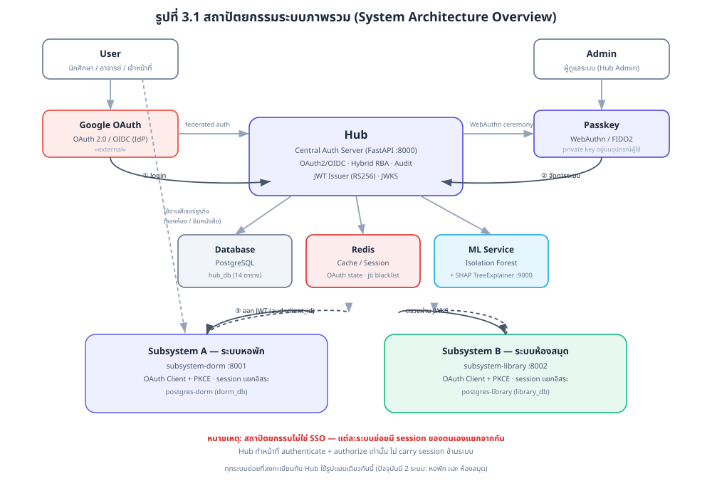

จากรูปที่ 3.1 จะเห็นว่า Google OAuth (OIDC) และ Passkey (WebAuthn) เป็นสองช่องทางยืนยันตัวตนที่เชื่อมต่อกับ Hub เพียงจุดเดียวเท่านั้น — ระบบย่อยไม่ได้ติดต่อกับ IdP หรืออุปกรณ์ผู้ใช้โดยตรง แต่ติดต่อกับ Hub ผ่านมาตรฐาน OAuth 2.0 + PKCE และตรวจสอบ token ที่ Hub ออกให้ผ่าน JWKS (cache 10 นาที) Hub เองก็พึ่งพาโครงสร้างพื้นฐาน 3 ส่วนคือ Database (PostgreSQL, `hub_db`) สำหรับข้อมูลถาวร, Redis สำหรับ session/cache/blacklist และ ML Service (Isolation Forest + SHAP) สำหรับให้คะแนนความเสี่ยงแบบ real-time โดยแต่ละ stack มีฐานข้อมูล PostgreSQL ของตนเองแยกกันอย่างชัดเจน เชื่อมต่อกันผ่านเครือข่าย `cah-net` ทำให้สามารถนำ stack ใดไป deploy บนเครื่องแยกได้โดยไม่กระทบกัน และเนื่องจากสถาปัตยกรรมไม่ใช่ SSO แต่ละระบบย่อยจึงยังคงมี session ของตนเองแยกจากกันเสมอ

มองในมุมสถาปัตยกรรมเชิงธุรกิจ (Business Architecture) ตามรูปที่ 3.2 ระบบแบ่งความรับผิดชอบออกเป็น 4 กลุ่ม (business capability) เรียงตามลำดับกระบวนการหลัก ได้แก่ การลงทะเบียนตัวตน (Identity & Onboarding) โดยอาจารย์/เจ้าหน้าที่/ผู้ดูแลระบบ การกำกับดูแลสิทธิ์ (Access Governance) โดยผู้ดูแลระบบ การบริหารความเสี่ยง (Risk & Trust Management) ที่ทำงานอัตโนมัติผ่าน Hybrid RBA และการดำเนินธุรกิจ/ตรวจสอบ (Business Operations & Compliance) ที่ผู้ใช้ปลายทางสัมผัสโดยตรงเมื่อจองห้องพักหรือยืม-คืนหนังสือ

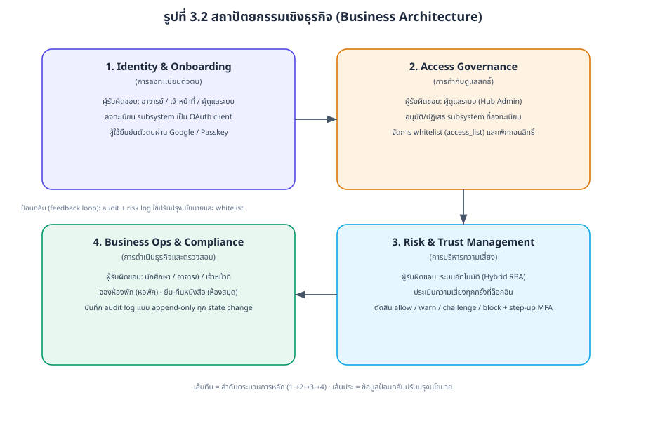

ในระดับสถาปัตยกรรมเชิงตรรกะ (Logical Architecture) รูปที่ 3.3 แสดงการแบ่งชั้นของทั้งระบบโดยไม่ผูกกับรายละเอียดการ deploy จริง ออกเป็น Presentation Layer, API/Integration Layer, Application Services Layer และ Data Layer โดยมี Security เป็น cross-cutting concern ที่ครอบทุกชั้น

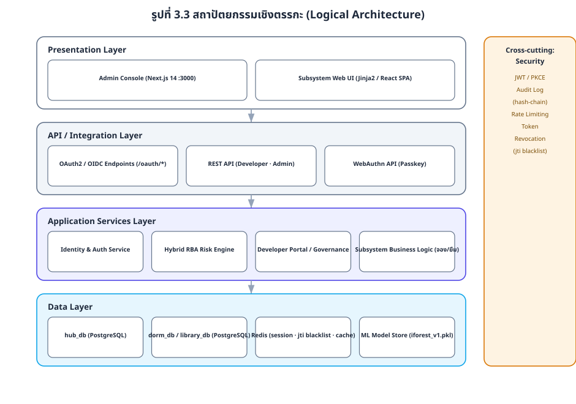

สถาปัตยกรรมแบ่งหน้าที่ออกเป็น 5 องค์ประกอบหลัก ดังนี้

## 3.5.1 Authentication Hub

Hub เป็นศูนย์กลางการจัดการการยืนยันตัวตนทั้งหมด พัฒนาด้วย Python 3.11 + FastAPI + SQLAlchemy ให้บริการ API มากกว่า 100 endpoint แบ่งเป็น 14 router ครอบคลุมการจัดการผู้ใช้งาน บทบาท (role) ระบบย่อยที่ลงทะเบียน (OAuth Clients) และ Passkey ของผู้ใช้ Hub ยังทำหน้าที่เป็นจุดเดียวที่เก็บ audit log ของทุกการกระทำที่กระทบสิทธิ์หรือข้อมูลผู้ใช้ และเป็นจุดเดียวที่เรียกใช้ Risk Engine เพื่อประเมินความเสี่ยงของทุก session

การออกแบบภายในของ Hub แบ่งความรับผิดชอบออกเป็น 4 ชั้น (แสดงเป็นคอมโพเนนต์ในรูปที่ 3.4 ท้ายหัวข้อ 3.5.5) ดังนี้

**Router Layer** เป็นชั้นบนสุดที่รับ HTTP request จากภายนอก ประกอบด้วย 14 router แบ่งตามหน้าที่ เช่น `/auth` (Google OAuth สำหรับ login เข้า Hub ตรง), `/oauth` (OAuth flow ของระบบย่อย), `/passkey` (WebAuthn), `/admin` (สำหรับผู้ดูแลระบบ), `/developer` (Developer Portal), `/secret` (ลิงก์ดู client_secret แบบครั้งเดียว) และ endpoint ตามมาตรฐาน OIDC (`/oidc`, `/introspection`, `/userinfo`) แต่ละ router จะผูกกับ dependency ตรวจสอบสิทธิ์ที่เหมาะสมเสมอ

**Service Layer** เป็นชั้นตรรกะทางธุรกิจที่ router เรียกใช้ เช่น `jwt_service` (ออก/ตรวจสอบ JWT), `audit_service` (บันทึก audit log), `secret_service` (Argon2id/Fernet), `pkce` (ตรวจสอบ PKCE ด้วย `hmac.compare_digest`), `feature_extraction` (สกัด feature 23 ตัวสำหรับ Risk Engine) และ `session_service`

**Security / RBA Layer** เป็นหัวใจด้านความปลอดภัย ประกอบด้วย Hybrid RBA 4 ชั้นที่ทำงานต่อเนื่องกัน คือ Rule Engine → Behavior Profiling → Isolation Forest (`ml_client`) → Risk Aggregator รายละเอียดของแต่ละชั้นอธิบายในหัวข้อ 3.8

**Data Access Layer** เป็นชั้นล่างสุดที่ติดต่อกับแหล่งข้อมูล ผ่าน SQLAlchemy ORM ไปยัง `hub-postgres` (14 ตาราง) และผ่าน `redis_client` ไปยัง `hub-redis` สำหรับเก็บ OAuth state, OTP และ risk challenge

การเรียก `ml-service` ที่อยู่นอก Hub ออกแบบให้ทำงานแบบ fail-safe — หากบริการ ML ล้มเหลว Hub จะได้รับค่า `score = 0.0` กลับมาแทน เพื่อไม่ให้ทั้งระบบล่มเพราะ ML

## 3.5.2 OAuth / OIDC Server

ส่วนนี้ทำหน้าที่ตามมาตรฐาน OAuth 2.0 Authorization Code Flow + PKCE และ OpenID Connect ได้แก่ การออก authorization code, การแลก code เป็น access token (JWT, RS256) ผ่าน `/oauth/token` แบบ server-to-server, การออก JWKS สำหรับให้ระบบย่อยตรวจสอบ signature ของ token (`/.well-known/jwks.json`) และ endpoint ตาม OIDC มาตรฐานสำหรับ discovery, userinfo และ token introspection ทุก token ที่ออกจะมี `aud` claim กำกับเสมอ — token สำหรับ Hub ตรงจะมี `aud=hub.internal` ส่วน token สำหรับระบบย่อยจะมี `aud=client_id` ของระบบย่อยนั้น เพื่อป้องกันการนำ token ของระบบหนึ่งไปใช้กับอีกระบบ

## 3.5.3 Passkey Service

เป็นส่วนที่ฝังอยู่ใน Hub backend ทำหน้าที่ตามมาตรฐาน WebAuthn/FIDO2 ทั้งการลงทะเบียนอุปกรณ์ (registration ceremony), การยืนยันตัวตนด้วยอุปกรณ์ (login ceremony), การจัดการ credential หลายอุปกรณ์ต่อผู้ใช้หนึ่งคน (เปลี่ยนชื่ออุปกรณ์ เพิกถอน), การ step-up re-authentication เมื่อ Risk Engine ตรวจพบความเสี่ยงระดับกลาง และกระบวนการกู้คืนบัญชีด้วย backup code หรือ email OTP เมื่อผู้ใช้ไม่สามารถใช้อุปกรณ์ Passkey เดิมได้

## 3.5.4 Risk Engine

Risk Engine เป็นกลไกประเมินความเสี่ยงแบบ Hybrid RBA 4 ชั้น ประกอบด้วย Rule Engine, Behavior Profiling, Isolation Forest (เรียกผ่าน ML Verifier ที่เป็น service แยก) และ Risk Aggregator ที่รวมคะแนนจากทั้งสามชั้นเป็นคะแนนเดียวเพื่อใช้ตัดสินใจ รายละเอียดของแต่ละชั้นอธิบายไว้ในหัวข้อ 3.8

## 3.5.5 Subsystem Applications

ระบบย่อยทั้งสอง (หอพักและห้องสมุด) ไม่จำเป็นต้องพัฒนาระบบ login ของตนเอง เพียงทำหน้าที่เป็น OAuth client ที่เชื่อมต่อกับ Hub ผ่าน flow มาตรฐาน (PKCE + token exchange + ตรวจสอบ JWT ด้วย JWKS ของ Hub ซึ่ง cache ไว้ 10 นาที) แต่ละระบบย่อยมี session ของตนเองที่แยกจาก Hub โดยใช้ signed cookie (itsdangerous) แบบ HttpOnly + SameSite และมีฐานข้อมูล PostgreSQL ของตนเองสำหรับเก็บ business data เช่น การจองห้องพักหรือการยืม-คืนหนังสือ พร้อมตาราง audit log แยกของแต่ละระบบย่อย

ระบบย่อยแบ่งเป็น 2 ชั้นหลักคือ **Router Layer** ที่รับ request จากเบราว์เซอร์ (แบ่งเป็นกลุ่ม auth สำหรับ login/logout, กลุ่ม pages สำหรับหน้าเว็บ และกลุ่ม business logic เฉพาะของแต่ละระบบ เช่น `/reservation` ของหอพัก หรือ `/borrow` ของห้องสมุด) และ **Service Layer** ที่มี 3 องค์ประกอบสำคัญคือ `hub_client` (จัดการ OAuth flow กับ Hub ตั้งแต่สร้าง PKCE ไปจนถึงตรวจสอบ JWT ผ่าน JWKS), `session` (สร้าง signed cookie ของระบบย่อยเอง) และ `audit` (บันทึก log ภายในระบบย่อย) ข้อมูลทางธุรกิจถูกเก็บในฐานข้อมูล PostgreSQL ของระบบย่อยเอง โดยอ้างอิงผู้ใช้ผ่าน `hub_user_id` (UUID จาก JWT) ไม่มี foreign key ข้ามไปยังฐานข้อมูลของ Hub

รูปที่ 3.4 รวมมุมมองคอมโพเนนต์ (Component Diagram) ของทั้ง Hub และระบบย่อยไว้ในภาพเดียว แสดง interface หลักที่แต่ละฝั่งพึ่งพากัน — `HubClient` ของระบบย่อยเรียกใช้ผ่าน `IOAuthAPI` ที่ Hub เปิดให้ ในขณะที่ `RBAEngine`/`MLClient` ภายใน Hub เรียก `IScoreAPI` ของ ML Verifier Service ซึ่งเป็นระบบภายนอกอีกชั้นหนึ่ง

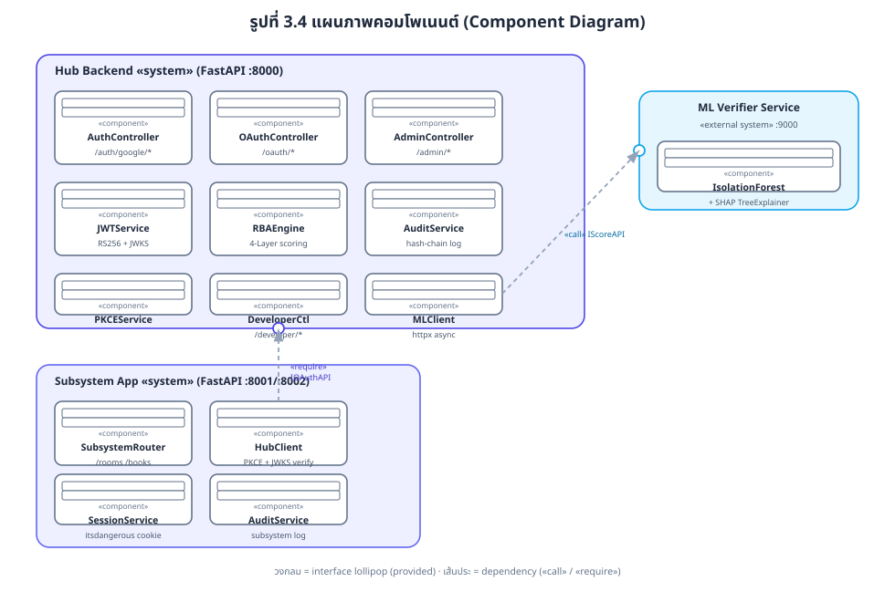

## 3.5.6 การลงทะเบียนระบบย่อย (Subsystem Registration)

ก่อนระบบย่อยจะเรียกใช้ Hub ได้ ต้องผ่านการลงทะเบียนเป็น OAuth client ก่อน กระบวนการนี้เข้มงวดกว่า endpoint ทั่วไป — นักพัฒนา (`require_developer`) ต้องผ่าน step-up MFA ก่อนจึงจะ submit คำขอได้ (ป้องกันไม่ให้ session ที่ถูกขโมยมาสร้างระบบย่อยปลอมเพื่อดักข้อมูลผู้ใช้) ขั้นตอนทั้งหมดแสดงในรูปที่ 3.5

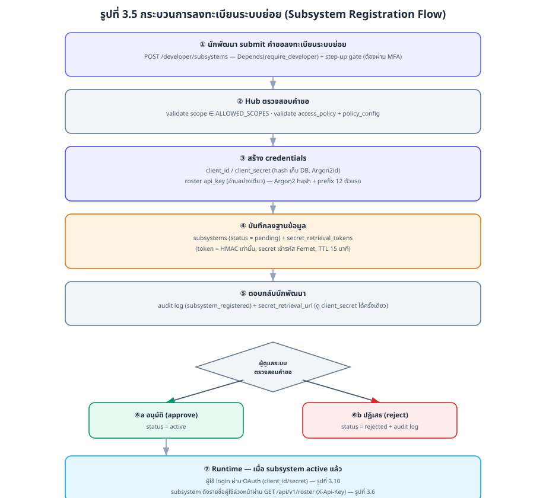

ตามรูปที่ 3.5 หลังนักพัฒนา submit คำขอ (①) Hub จะตรวจสอบ scope ที่ขอต้องอยู่ใน `ALLOWED_SCOPES` และตรวจสอบค่า access policy ที่เลือก (②) จากนั้นสร้าง `client_id`/`client_secret` (hash ด้วย Argon2id) พร้อม roster API key แยกต่างหากสำหรับดึงรายชื่อผู้ใช้แบบอ่านอย่างเดียว (③) บันทึกระบบย่อยด้วยสถานะ `pending` พร้อม one-time secret retrieval token ที่มีอายุ 15 นาที (④) แล้วส่ง URL สำหรับดู `client_secret` กลับไปให้นักพัฒนาดูได้เพียงครั้งเดียว (⑤) ก่อนที่ผู้ดูแลระบบจะตรวจสอบและอนุมัติหรือปฏิเสธคำขอ (⑥) เมื่อระบบย่อย active แล้วจึงเริ่มใช้งาน OAuth flow จริง (รูปที่ 3.10) และดึง roster ผ่าน `GET /api/v1/roster` ได้ (⑦)

## 3.5.7 การควบคุมสิทธิ์การเข้าถึง (Access Policy)

เมื่อลงทะเบียนระบบย่อย นักพัฒนาต้องเลือก access policy ว่าใครเข้าระบบย่อยนี้ได้บ้าง ระบบรองรับ 4 รูปแบบ ดังแสดงในรูปที่ 3.6

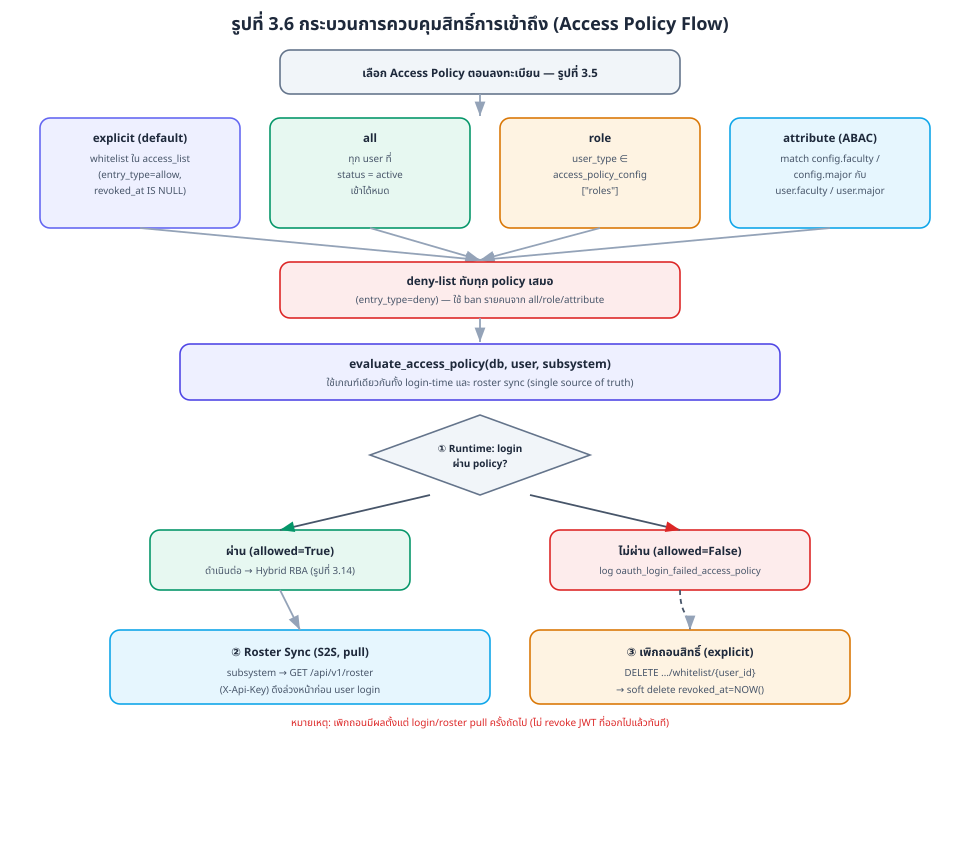

จากรูปที่ 3.6 ทั้ง 4 รูปแบบ ได้แก่ **explicit** (ค่าเริ่มต้น) ใช้ whitelist ในตาราง `access_list` (`entry_type='allow'`, `revoked_at IS NULL`), **all** อนุญาตทุกผู้ใช้ที่ `status='active'`, **role** อนุญาตตาม `user_type` ที่ระบุใน `access_policy_config["roles"]` และ **attribute** ใช้หลัก ABAC เทียบ `faculty`/`major` ของผู้ใช้กับเงื่อนไขที่กำหนด ไม่ว่าจะเลือกรูปแบบใด **deny-list** (`entry_type='deny'`) จะทับทุก policy เสมอ ใช้สำหรับ ban รายบุคคลออกจาก policy ที่เปิดกว้าง (เช่น `all`) โดยยังเก็บ audit trail

ฟังก์ชัน `evaluate_access_policy()` ถูกเรียกใช้ 2 จุดด้วยเกณฑ์เดียวกัน (single source of truth) คือ ① ตอน login จริงที่ `/oauth/callback` และ ② ตอนระบบย่อยดึง roster ล่วงหน้าผ่าน `GET /api/v1/roster` (S2S, ยืนยันตัวตนด้วย `X-Api-Key`) — ออกแบบให้ subsystem ที่ต้อง pre-create ข้อมูล (เช่น ระบบเกรด) ดึงรายชื่อผู้มีสิทธิ์ได้ก่อนที่ผู้ใช้จะ login จริง ส่วนการเพิกถอนสิทธิ์ (③, เฉพาะ policy `explicit`) ใช้ soft delete (`revoked_at = NOW()`) มีผลตั้งแต่การตรวจสอบครั้งถัดไป ไม่ยกเลิก JWT ที่ออกไปแล้วทันที (การ revoke token ทำแยกผ่านกลไก jti blacklist — ดูหัวข้อ 3.7.2)

## 3.5.8 สถาปัตยกรรมการติดตั้ง (Deployment Architecture)

การติดตั้งระบบจริงใช้ VPS เครื่องเดียวรัน Docker Compose ทั้ง 3 stack ผ่าน Nginx เป็น reverse proxy กลาง ทำหน้าที่ terminate TLS (Let's Encrypt) แล้ว route คำขอตาม subdomain ไปยัง service ภายในที่ไม่ได้ expose พอร์ตออกสู่ public โดยตรง ดังแสดงในรูปที่ 3.7

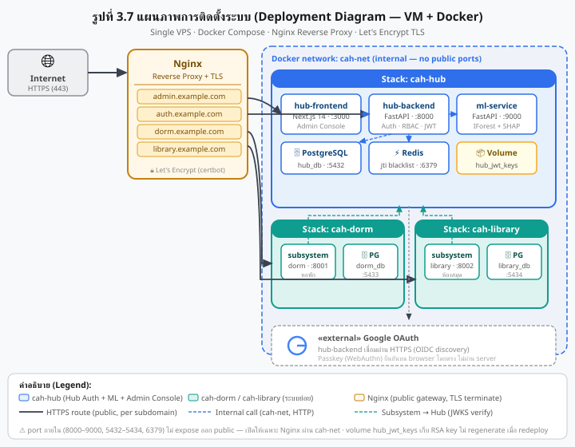

เครือข่ายภายใน `cah-net` ทำให้ `hub-backend`, `ml-service`, `subsystem-dorm` และ `subsystem-library` สื่อสารกันได้โดยไม่ต้องผ่านอินเทอร์เน็ต ขณะที่ volume `hub_jwt_keys` เก็บกุญแจ RSA ของ JWT ไว้แยกจาก container เพื่อไม่ให้ต้อง regenerate ทุกครั้งที่ redeploy การติดตั้งแบบ VM เดียวนี้เหมาะสำหรับ demo/senior project — หากนำไป production จริงสามารถแยกแต่ละ stack ไปคนละเครื่องได้ตามที่ออกแบบไว้ตั้งแต่ต้น (independent docker-compose ต่อ stack)

---

# 3.6 การออกแบบฐานข้อมูล

ฐานข้อมูลของระบบทั้งหมดใช้ **PostgreSQL 15** แยกเป็น 3 instance ตามแต่ละ stack คือ `hub_db` (Hub), `dorm_db` (ระบบหอพัก) และ `library_db` (ระบบห้องสมุด) โดยตารางในฐานข้อมูลของระบบย่อยไม่มี foreign key อ้างไปยังฐานข้อมูลของ Hub — ผู้ใช้จาก Hub จะถูกอ้างถึงด้วย UUID ที่อ่านได้จาก JWT (`sub` claim) เท่านั้น ซึ่งสอดคล้องกับหลักการที่ว่าแต่ละระบบย่อยเป็นอิสระจากกัน

## 3.6.1 ฐานข้อมูลของ Hub (`hub_db`)

รูปที่ 3.8 แสดงแผนภาพความสัมพันธ์ (ER diagram) ของฐานข้อมูลทั้งหมดในระบบรวมกันในภาพเดียว ทั้งฝั่ง Hub (`hub_db`) และฝั่งระบบย่อย (`dorm_db`/`library_db`) เพื่อให้เห็นทั้งความสัมพันธ์ภายในแต่ละฐานข้อมูล และเส้นประที่แสดงว่า `hub_user_id` เชื่อมโยงกันเชิงตรรกะข้ามฐานข้อมูลโดยไม่มี foreign key จริง ส่วนบนของรูป (Hub) แสดงเฉพาะตารางสำคัญและ field หลักที่ใช้เชื่อมความสัมพันธ์ เพื่อให้เห็นภาพรวมว่า `users` เป็นตารางศูนย์กลางที่ตารางอื่นอ้างอิงถึง ส่วนรายละเอียดของทุก field อยู่ในตาราง data dictionary ถัดจากรูป

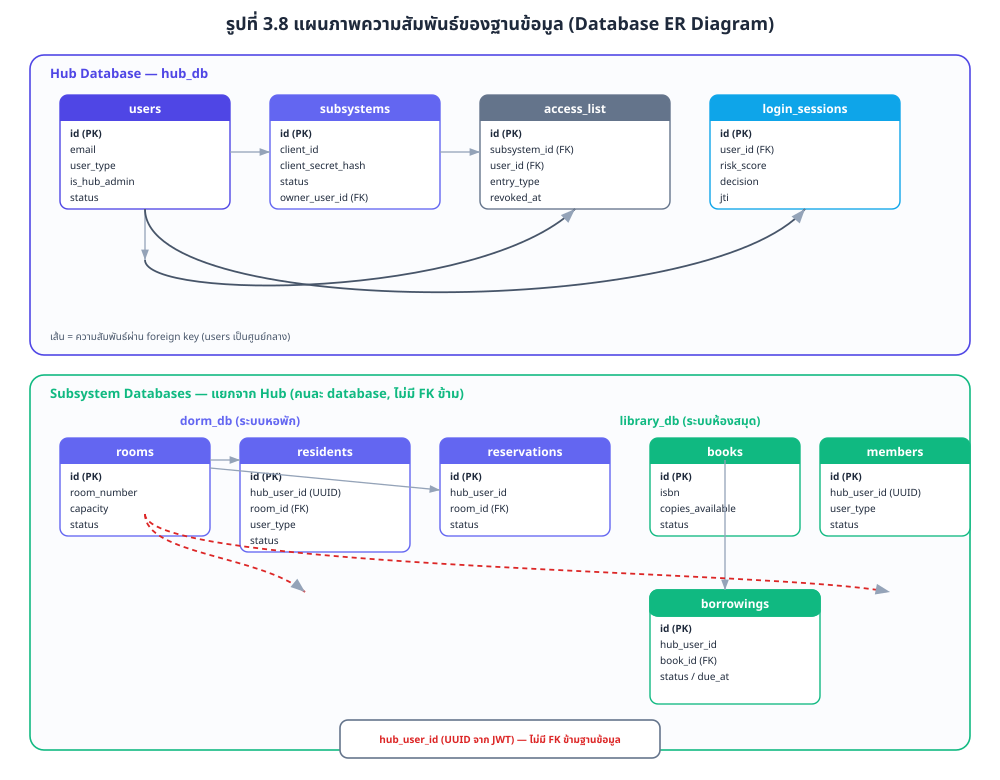

ฐานข้อมูล Hub มีทั้งหมด 14 ตาราง แบ่งเป็นตารางหลัก 7 ตาราง และตารางสนับสนุนที่เพิ่มตามฟีเจอร์ที่ขยายเข้ามาอีก 7 ตาราง ด้านล่างเป็น data dictionary อธิบายทุก field ของแต่ละตาราง

### ตาราง `users` — ข้อมูลผู้ใช้

| Field | ชนิดข้อมูล | คำอธิบาย |
|---|---|---|
| `id` | UUID (PK) | รหัสประจำตัวผู้ใช้ — primary key แบบ UUID กัน enumeration |
| `google_sub` | varchar(255) | ตัวระบุผู้ใช้จาก Google OAuth (subject) — NULL ตอน seed ก่อน login จริง |
| `email` | varchar(255) | อีเมล — unique ใช้เป็น identifier หลักในการ login |
| `full_name` | varchar(255) | ชื่อ-นามสกุลเต็ม |
| `user_type` | varchar(20) | ประเภทผู้ใช้: `student` / `teacher` / `staff` / `admin` — ฐานของ RBAC |
| `identifier` | varchar(50) | รหัสนักศึกษาหรือรหัสพนักงาน |
| `faculty` | varchar(100) | คณะ |
| `major` | varchar(100) | สาขาวิชา |
| `year_or_position` | varchar(50) | ชั้นปี (นักศึกษา) หรือตำแหน่ง (บุคลากร) |
| `phone` | varchar(20) | เบอร์โทรศัพท์ |
| `address` | text | ที่อยู่ |
| `status` | varchar(20) | สถานะบัญชี: `active` / `suspended` / `deleted` |
| `is_hub_admin` | boolean | เป็นผู้ดูแลระบบ Hub หรือไม่ — ใช้ตรวจสิทธิ์ `require_hub_admin` |
| `email_verified` | boolean | อีเมลได้รับการยืนยันแล้วหรือยัง (ใช้เป็นช่องทางกู้คืนบัญชี) |
| `email_verified_at` | timestamp | เวลาที่ยืนยันอีเมล |
| `created_at` | timestamp | เวลาที่สร้างบัญชี |
| `updated_at` | timestamp | เวลาที่แก้ไขล่าสุด |

### ตาราง `subsystems` — ระบบย่อยที่ลงทะเบียนเป็น OAuth Client

| Field | ชนิดข้อมูล | คำอธิบาย |
|---|---|---|
| `id` | UUID (PK) | รหัสระบบย่อย |
| `name` | varchar(255) | ชื่อระบบย่อย เช่น ระบบหอพัก, ระบบห้องสมุด |
| `description` | text | คำอธิบายระบบย่อย |
| `client_id` | varchar(64) | รหัส OAuth client — unique ใช้เป็น `aud` ของ token |
| `client_secret_hash` | text | ค่า hash ของ client_secret (Argon2id) — ไม่เก็บ plaintext |
| `redirect_uris` | text[] | รายการ URL ที่อนุญาตให้ redirect กลับหลัง OAuth |
| `scope` | text[] | ขอบเขตข้อมูลที่ระบบย่อยขอได้ เช่น email, name, faculty |
| `previous_client_secret_hash` | text | hash ของ secret เดิม (ช่วง grace period 24 ชม. หลัง rotate) |
| `previous_secret_expires_at` | timestamp | เวลาหมดอายุของ secret เดิม |
| `allowed_roles` | text[] | บทบาทที่อนุญาตใน `access_list.role_in_sub` |
| `access_revoke_webhook_url` | text | URL ให้ Hub ยิง webhook แจ้งเมื่อ revoke สิทธิ์ (back-channel) |
| `status` | varchar(20) | สถานะ: `pending` / `active` / `suspended` |
| `access_policy` | varchar(20) | นโยบายการเข้าถึง: `explicit` (whitelist) / `all` / `role` / `attribute` |
| `access_policy_config` | JSON | เงื่อนไขของ policy เช่น รายชื่อ role หรือ attribute ที่อนุญาต |
| `api_key_hash` | text | hash ของ API key แบบ read-only สำหรับดึง roster (S2S) |
| `api_key_prefix` | varchar(12) | ส่วนต้นของ API key ไว้แสดงระบุ key ใน UI |
| `owner_user_id` | UUID (FK→users) | เจ้าของ/ผู้ลงทะเบียนระบบย่อย |
| `created_at` | timestamp | เวลาที่ลงทะเบียน |
| `approved_at` | timestamp | เวลาที่ admin อนุมัติ |

### ตาราง `access_list` — whitelist สิทธิ์เข้าถึงระบบย่อย

| Field | ชนิดข้อมูล | คำอธิบาย |
|---|---|---|
| `id` | UUID (PK) | รหัสรายการสิทธิ์ |
| `subsystem_id` | UUID (FK→subsystems) | ระบบย่อยที่ให้สิทธิ์ |
| `user_id` | UUID (FK→users) | ผู้ใช้ที่ได้รับสิทธิ์ |
| `role_in_sub` | varchar(50) | บทบาทในระบบย่อย (deprecated — ปัจจุบันใช้ `user_type` แทน) |
| `entry_type` | varchar(10) | `allow` (อนุญาต) หรือ `deny` (แบนรายคน ทับ policy อื่น) |
| `granted_by` | UUID (FK→users) | ผู้ให้สิทธิ์ |
| `granted_at` | timestamp | เวลาที่ให้สิทธิ์ |
| `revoked_at` | timestamp | เวลาที่เพิกถอน (NULL = ยังมีสิทธิ์) — soft delete |

ตารางนี้ใช้เก็บ whitelist สำหรับ policy แบบ `explicit` เท่านั้น — กระบวนการควบคุมสิทธิ์การเข้าถึงทั้ง 4 รูปแบบอธิบายไว้แล้วในหัวข้อ 3.5.7 (รูปที่ 3.6)

### ตาราง `login_sessions` — บันทึกการเข้าสู่ระบบ (audit + ML)

| Field | ชนิดข้อมูล | คำอธิบาย |
|---|---|---|
| `id` | UUID (PK) | รหัส session |
| `user_id` | UUID (FK→users) | ผู้ใช้ที่ login |
| `subsystem_id` | UUID (FK→subsystems) | ระบบย่อยที่เข้าถึง (NULL = login เข้า Hub ตรง) |
| `ip` | inet | IP ที่ login เข้ามา |
| `user_agent` | text | User-Agent ของเบราว์เซอร์ |
| `geo_country` | varchar(50) | ประเทศจาก GeoIP |
| `geo_city` | varchar(100) | เมืองจาก GeoIP |
| `os_name` | varchar(100) | ระบบปฏิบัติการที่ parse จาก user agent |
| `browser` | varchar(100) | เบราว์เซอร์ที่ parse จาก user agent |
| `device_type` | varchar(20) | ชนิดอุปกรณ์: mobile / desktop / tablet / bot |
| `anomaly_score` | numeric(3,2) | คะแนน anomaly จาก Isolation Forest (0.00–1.00) |
| `risk_score` | numeric(4,3) | คะแนนความเสี่ยงรวมจาก RBA 4 ชั้น (0.000–1.000) |
| `risk_breakdown` | JSON | คะแนนแยกแต่ละชั้น เช่น `{"rule":0.3,"behavior":0.2,"iforest":0.1}` |
| `risk_reasons` | JSON | เหตุผลของคะแนน เช่น `["is_new_device (+0.30)"]` |
| `decision` | varchar(20) | ผลตัดสิน: allow / warn / challenge / block / would_* |
| `login_method` | varchar(20) | ช่องทาง login: google / passkey / discoverable / line / hub_direct |
| `is_attack_ip` | boolean | IP อยู่ใน blacklist หรือไม่ (ground truth) |
| `is_account_takeover` | boolean | admin ยืนยันว่าเป็น attacker จริงหรือไม่ (ground truth) |
| `created_at` | timestamp | เวลาที่ login |
| `logout_at` | timestamp | เวลาที่ปิด session (NULL = ยังเปิดอยู่) |
| `jti` | varchar(64) | JWT identifier ของ token — ใช้ force-revoke |

### ตาราง `audit_logs` — บันทึกการกระทำ (append-only)

| Field | ชนิดข้อมูล | คำอธิบาย |
|---|---|---|
| `id` | UUID (PK) | รหัสรายการ log |
| `actor_id` | UUID | ผู้กระทำ (NULL = ระบบกระทำเอง) |
| `action` | varchar(100) | ชื่อการกระทำ เช่น `access_added`, `login_blocked` |
| `target_type` | varchar(50) | ชนิดของเป้าหมาย เช่น user, subsystem |
| `target_id` | UUID | รหัสของเป้าหมาย |
| `ip` | inet | IP ของผู้กระทำ |
| `metadata` | JSON | รายละเอียดเพิ่มเติมของการกระทำ (แมปกับ attribute `metadata_json`) |
| `created_at` | timestamp | เวลาที่เกิดการกระทำ |

### ตาราง `request_logs` — บันทึก HTTP request ทุกตัว

| Field | ชนิดข้อมูล | คำอธิบาย |
|---|---|---|
| `id` | UUID (PK) | รหัสรายการ |
| `method` | varchar(10) | HTTP method เช่น GET, POST |
| `path` | text | เส้นทางที่เรียก |
| `status_code` | integer | HTTP status ที่ตอบกลับ |
| `user_id` | UUID | ผู้ใช้ (NULL ถ้าเป็น request ที่ไม่ล็อกอิน) — ไม่มี FK |
| `ip` | inet | IP ผู้เรียก |
| `user_agent` | text | User-Agent |
| `duration_ms` | integer | เวลาที่ใช้ประมวลผล (มิลลิวินาที) |
| `error_detail` | text | รายละเอียด error (ถ้ามี) |
| `created_at` | timestamp | เวลาที่รับ request |

### ตาราง `subsystem_change_requests` — คำขอแก้ไขระบบย่อยที่รออนุมัติ

| Field | ชนิดข้อมูล | คำอธิบาย |
|---|---|---|
| `id` | UUID (PK) | รหัสคำขอ |
| `subsystem_id` | UUID (FK→subsystems) | ระบบย่อยที่ขอแก้ไข |
| `requested_by` | UUID (FK→users) | ผู้ยื่นคำขอ |
| `request_type` | varchar(50) | ประเภทคำขอ: rotate_secret / edit_scope / edit_allowed_roles / edit_redirect_uris |
| `payload` | JSON | ค่าใหม่ที่ต้องการเปลี่ยน |
| `status` | varchar(20) | pending / approved / rejected / cancelled |
| `reviewer_id` | UUID (FK→users) | ผู้พิจารณา (admin) |
| `reviewer_note` | text | หมายเหตุจากผู้พิจารณา |
| `created_at` | timestamp | เวลาที่ยื่นคำขอ |
| `reviewed_at` | timestamp | เวลาที่พิจารณา |

### ตาราง `secret_retrieval_tokens` — ลิงก์ดู client_secret แบบครั้งเดียว

| Field | ชนิดข้อมูล | คำอธิบาย |
|---|---|---|
| `id` | UUID (PK) | รหัสรายการ |
| `token` | varchar(128) | HMAC-SHA256 ของ token จริง — ไม่เก็บ plaintext |
| `subsystem_id` | UUID (FK→subsystems) | ระบบย่อยที่ token ผูกอยู่ |
| `secret_encrypted` | text | client_secret ที่เข้ารหัสด้วย Fernet (ลบหลังใช้) |
| `expires_at` | timestamp | เวลาหมดอายุ (15 นาทีจากการสร้าง) |
| `used_at` | timestamp | เวลาที่ถูกใช้ (NULL = ยังไม่ถูกใช้) |
| `created_at` | timestamp | เวลาที่สร้าง |

### ตาราง `ml_feedback` — ความเห็นของ admin ต่อผล ML (ground truth สำหรับ retrain)

| Field | ชนิดข้อมูล | คำอธิบาย |
|---|---|---|
| `id` | UUID (PK) | รหัสรายการ |
| `session_id` | UUID (FK→login_sessions) | session ที่ให้ความเห็น (unique — 1 session ต่อ 1 label) |
| `label` | varchar(20) | false_positive / true_positive / normal_confirmed |
| `note` | text | หมายเหตุ |
| `marked_by` | UUID (FK→users) | ผู้ให้ความเห็น |
| `created_at` | timestamp | เวลาที่บันทึก |

### ตาราง `api_alerts` — การแจ้งเตือนพฤติกรรม API ผิดปกติ

| Field | ชนิดข้อมูล | คำอธิบาย |
|---|---|---|
| `id` | UUID (PK) | รหัสการแจ้งเตือน |
| `rule` | varchar(50) | กฎที่ตรวจพบ เช่น excessive_requests, bot_pattern |
| `severity` | varchar(20) | ระดับความรุนแรง: warning / critical |
| `ip` | inet | IP ต้นทาง |
| `user_id` | UUID | ผู้ใช้ที่เกี่ยวข้อง (ถ้ามี) |
| `detail` | JSON | รายละเอียด เช่น จำนวน request, ช่วงเวลา, threshold |
| `resolved` | boolean | จัดการแล้วหรือยัง |
| `created_at` | timestamp | เวลาที่แจ้งเตือน |

### ตาราง `ip_blacklist` — รายการ IP ที่ถูกบล็อก

| Field | ชนิดข้อมูล | คำอธิบาย |
|---|---|---|
| `id` | UUID (PK) | รหัสรายการ |
| `ip_address` | varchar(50) | IP ที่ถูกบล็อก — unique |
| `reason` | text | เหตุผลที่บล็อก |
| `added_by` | UUID (FK→users) | ผู้เพิ่ม (NULL = ระบบเพิ่มอัตโนมัติ) |
| `created_at` | timestamp | เวลาที่บล็อก |

### ตาราง `passkey_credentials` — WebAuthn credential ต่ออุปกรณ์

| Field | ชนิดข้อมูล | คำอธิบาย |
|---|---|---|
| `id` | UUID (PK) | รหัส credential |
| `user_id` | UUID (FK→users) | เจ้าของ (1 user มีได้หลายอุปกรณ์) |
| `credential_id` | bytea | รหัส credential ตามมาตรฐาน WebAuthn — unique |
| `public_key` | bytea | public key ของอุปกรณ์ (private key อยู่ในอุปกรณ์เท่านั้น) |
| `sign_count` | integer | ตัวนับการเซ็น — ใช้ตรวจ cloned credential |
| `aaguid` | UUID | ตัวระบุรุ่นของ authenticator |
| `transports` | text[] | ช่องทางเชื่อมต่อ: usb / nfc / ble / internal / hybrid |
| `device_name` | varchar(100) | ชื่ออุปกรณ์ที่ผู้ใช้ตั้ง |
| `device_type` | varchar(50) | platform / cross-platform |
| `nickname_history` | JSONB | ประวัติการเปลี่ยนชื่ออุปกรณ์ |
| `created_at` | timestamp | เวลาที่ลงทะเบียนอุปกรณ์ |
| `last_used_at` | timestamp | เวลาใช้งานล่าสุด |
| `last_used_ip` | inet | IP ที่ใช้งานล่าสุด |
| `last_used_user_agent` | text | User-Agent ที่ใช้งานล่าสุด |
| `revoked_at` | timestamp | เวลาที่เพิกถอน (NULL = ยังใช้งานได้) — soft delete |
| `revoked_reason` | varchar(50) | เหตุผลเพิกถอน: user_deleted / admin_reset / backup_recovery / email_recovery |
| `backup_eligible` | boolean | อุปกรณ์รองรับการ backup credential หรือไม่ |
| `backup_state` | boolean | credential ถูก backup แล้วหรือยัง |
| `counter_regression_count` | integer | จำนวนครั้งที่ตรวจพบ sign_count ถอยหลัง (สัญญาณ clone) |
| `last_counter_regression_at` | timestamp | เวลาที่พบ counter regression ล่าสุด |

### ตาราง `passkey_backup_codes` — รหัสสำรองสำหรับกู้คืนบัญชี

| Field | ชนิดข้อมูล | คำอธิบาย |
|---|---|---|
| `id` | UUID (PK) | รหัสรายการ |
| `user_id` | UUID (FK→users) | เจ้าของรหัสสำรอง |
| `code_hash` | text | ค่า hash ของรหัส (Argon2id) — แสดง plaintext ครั้งเดียวตอนสร้าง |
| `used_at` | timestamp | เวลาที่ใช้รหัส (NULL = ยังไม่ใช้) |
| `used_ip` | inet | IP ที่ใช้รหัส |
| `used_user_agent` | text | User-Agent ที่ใช้รหัส |
| `generation` | integer | รอบการสร้าง — regenerate = generation +1 (รอบเก่าถือว่า invalid) |
| `created_at` | timestamp | เวลาที่สร้างรหัส |
| `acknowledged_at` | timestamp | เวลาที่ผู้ใช้ยืนยันว่าบันทึกรหัสแล้ว |

### ตาราง `app_settings` — ค่าคอนฟิกที่ปรับได้ตอน runtime

| Field | ชนิดข้อมูล | คำอธิบาย |
|---|---|---|
| `key` | varchar(100) (PK) | ชื่อ setting เช่น auth-policy |
| `value` | JSON | ค่าของ setting (ยืดหยุ่นตามชนิด setting) |
| `updated_by` | UUID | ผู้แก้ไขล่าสุด |
| `updated_at` | timestamp | เวลาที่แก้ไขล่าสุด |

## 3.6.2 ฐานข้อมูลของระบบย่อย

ระบบย่อยทั้งสองมีฐานข้อมูลของตนเองแยกจาก Hub และใช้แนวทางออกแบบเดียวกัน คือเก็บ `hub_user_id` เป็น UUID ที่ได้จาก JWT โดยไม่มี foreign key ข้าม database ส่วนล่างของรูปที่ 3.8 (หัวข้อ 3.6.1) แสดง ER ของทั้งสองระบบเทียบกันไว้แล้ว

### ระบบหอพัก (`dorm_db`)

**ตาราง `rooms`** — ห้องพัก

| Field | ชนิดข้อมูล | คำอธิบาย |
|---|---|---|
| `id` | UUID (PK) | รหัสห้อง |
| `building` | varchar(10) | อาคาร (A / B) |
| `floor` | integer | ชั้น |
| `room_number` | varchar(10) | เลขห้อง เช่น A101 — unique |
| `capacity` | integer | ความจุ (คน) |
| `status` | varchar(20) | available / full / maintenance |
| `created_at` / `updated_at` | timestamp | เวลาสร้าง / แก้ไขล่าสุด |

**ตาราง `residents`** — ผู้พัก (สร้างจาก JWT ตอน login ครั้งแรก)

| Field | ชนิดข้อมูล | คำอธิบาย |
|---|---|---|
| `id` | UUID (PK) | รหัสผู้พัก |
| `hub_user_id` | UUID | รหัสผู้ใช้จาก Hub (JWT.sub) — unique, ไม่มี FK |
| `email`, `full_name` | varchar | อีเมล/ชื่อ ที่ได้จาก JWT |
| `student_id`, `employee_id` | varchar(50) | รหัสนักศึกษา/พนักงาน (ตาม scope) |
| `faculty`, `major`, `year`, `position` | varchar | ข้อมูลจาก scope ที่ Hub ส่งมา |
| `phone`, `address` | varchar/text | ข้อมูลติดต่อ (ตาม scope) |
| `user_type` | varchar(50) | student = ผู้พัก, staff/teacher/admin = เจ้าหน้าที่ |
| `room_id` | UUID (FK→rooms) | ห้องที่พัก |
| `checked_in_at` / `checked_out_at` | timestamp | เวลาเช็คอิน / เช็คเอาท์ |
| `status` | varchar(20) | active / checked_in / checked_out |
| `hub_access_revoked_at` | timestamp | เวลาที่ Hub เพิกถอนสิทธิ์ (sync ผ่าน webhook) |
| `created_at` / `updated_at` | timestamp | เวลาสร้าง / แก้ไขล่าสุด |

**ตาราง `reservations`** — คำขอจองห้อง

| Field | ชนิดข้อมูล | คำอธิบาย |
|---|---|---|
| `id` | UUID (PK) | รหัสการจอง |
| `hub_user_id` | UUID | ผู้ขอจอง (จาก JWT) |
| `room_id` | UUID (FK→rooms) | ห้องที่ขอจอง (ondelete RESTRICT) |
| `status` | varchar(20) | pending / approved / rejected / checked_in / cancelled |
| `reason` | text | เหตุผลที่ขอห้องนี้ |
| `approved_by_hub_user_id` | UUID | เจ้าหน้าที่ที่อนุมัติ |
| `approved_at` / `rejected_at` | timestamp | เวลาอนุมัติ / ปฏิเสธ |
| `reject_reason` | text | เหตุผลปฏิเสธ |
| `checked_in_at` | timestamp | เวลาเช็คอิน |
| `cancelled_at` | timestamp | เวลายกเลิก (soft delete) |
| `created_at` | timestamp | เวลาที่ยื่นคำขอ |

**ตาราง `dorm_audit_logs`** — audit log ของระบบหอพัก (โครงสร้างเดียวกับ `audit_logs` ของ Hub: `id`, `actor_hub_user_id`, `action`, `target_type`, `target_id`, `ip`, `metadata`, `created_at`)

### ระบบห้องสมุด (`library_db`)

**ตาราง `books`** — หนังสือ

| Field | ชนิดข้อมูล | คำอธิบาย |
|---|---|---|
| `id` | UUID (PK) | รหัสหนังสือ |
| `isbn` | varchar(20) | ISBN — unique |
| `title` | varchar(255) | ชื่อหนังสือ |
| `author` | varchar(255) | ผู้แต่ง |
| `category` | varchar(100) | หมวดหมู่ |
| `description` | text | คำอธิบาย |
| `copies_total` | integer | จำนวนเล่มทั้งหมด |
| `copies_available` | integer | จำนวนเล่มที่ว่างให้ยืม |
| `status` | varchar(20) | active / withdrawn |
| `created_at` / `updated_at` | timestamp | เวลาสร้าง / แก้ไขล่าสุด |

**ตาราง `members`** — สมาชิก (สร้างจาก JWT ตอน login ครั้งแรก)

| Field | ชนิดข้อมูล | คำอธิบาย |
|---|---|---|
| `id` | UUID (PK) | รหัสสมาชิก |
| `hub_user_id` | UUID | รหัสผู้ใช้จาก Hub (JWT.sub) — unique, ไม่มี FK |
| `email`, `full_name` | varchar | อีเมล/ชื่อ จาก JWT |
| `student_id`, `employee_id` | varchar(50) | รหัสนักศึกษา/พนักงาน (ตาม scope) |
| `faculty`, `major`, `year`, `position` | varchar | ข้อมูลจาก scope |
| `phone`, `address` | varchar/text | ข้อมูลติดต่อ (ตาม scope) |
| `user_type` | varchar(50) | student = สมาชิก, staff/teacher/admin = บรรณารักษ์ |
| `status` | varchar(20) | active / suspended |
| `hub_access_revoked_at` | timestamp | เวลาที่ Hub เพิกถอนสิทธิ์ (sync ผ่าน webhook) |
| `created_at` / `updated_at` | timestamp | เวลาสร้าง / แก้ไขล่าสุด |

**ตาราง `borrowings`** — การยืม-คืนหนังสือ

| Field | ชนิดข้อมูล | คำอธิบาย |
|---|---|---|
| `id` | UUID (PK) | รหัสการยืม |
| `hub_user_id` | UUID | ผู้ยืม (จาก JWT) |
| `book_id` | UUID (FK→books) | หนังสือที่ยืม |
| `status` | varchar(20) | requested / active / returned / cancelled |
| `requested_at` | timestamp | เวลาที่ขอยืม |
| `approved_at` | timestamp | เวลาอนุมัติ |
| `approved_by_hub_user_id` | UUID | บรรณารักษ์ที่อนุมัติ |
| `borrowed_at` | timestamp | เวลาที่เริ่มยืม |
| `due_at` | timestamp | กำหนดคืน (ใช้คำนวณ overdue) |
| `returned_at` | timestamp | เวลาที่คืน |
| `received_by_hub_user_id` | UUID | บรรณารักษ์ที่รับคืน |
| `cancelled_at` | timestamp | เวลายกเลิก (soft delete) |
| `cancel_reason` | text | เหตุผลยกเลิก |

**ตาราง `library_audit_logs`** — audit log ของระบบห้องสมุด (โครงสร้างเดียวกับ `dorm_audit_logs`)

## 3.6.3 ข้อตกลงร่วมในการออกแบบฐานข้อมูล

ในเชิงข้อตกลงร่วม (convention) ทุกตารางในระบบใช้ UUID เป็น primary key เพื่อป้องกัน enumeration attack และเก็บ timestamp ทั้งหมดเป็น UTC โดยแปลงเป็นเวลาไทย (Asia/Bangkok) เฉพาะเวลาแสดงผล ส่วนคะแนนความเสี่ยงทุกค่าจัดเก็บด้วย `NUMERIC` เพื่อหลีกเลี่ยงปัญหาความแม่นยำของ floating point

---

# 3.7 การออกแบบระบบยืนยันตัวตน

ในระดับภาพรวมของกระบวนการเลือกวิธียืนยันตัวตน (Google OAuth หรือ Passkey) จนถึงจุดที่ทั้งสองวิธีมาบรรจบกันที่ Risk Engine แสดงเป็น flowchart ในรูปที่ 3.9

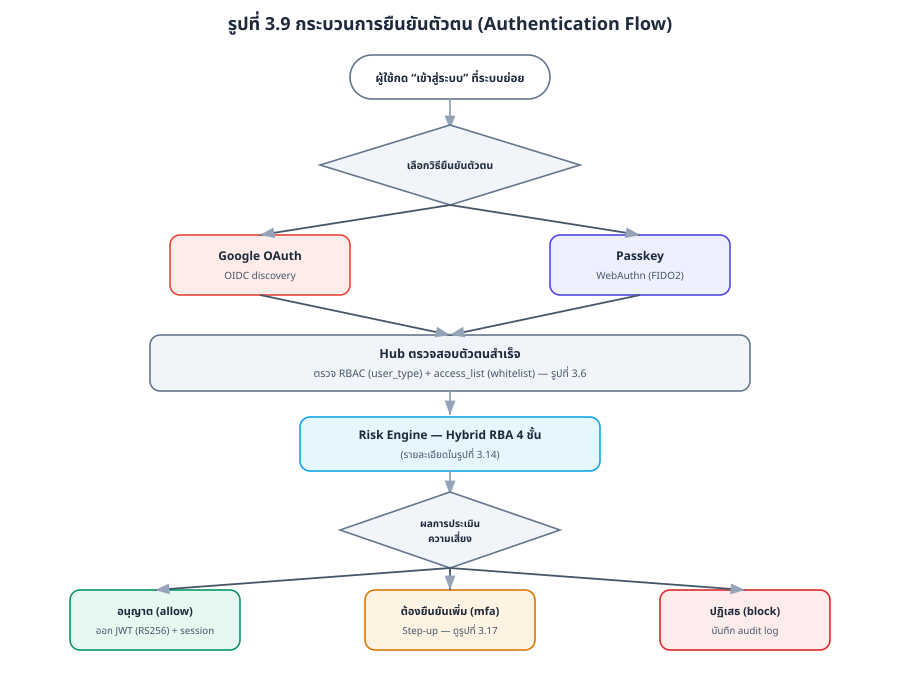

## 3.7.1 Google OAuth (OAuth 2.0 + OIDC)

Google OAuth เชื่อมต่อผ่าน OIDC Discovery ด้วยไลบรารี Authlib Hub ทำหน้าที่เป็น Relying Party ที่รับ identity จาก Google แล้วแปลงเป็น JWT ของ Hub เอง ทำให้ระบบย่อยไม่ต้องรู้จัก Google โดยตรง

รายละเอียดระดับโปรโตคอลของขั้นตอน OAuth 2.0 + PKCE เมื่อผู้ใช้เข้าสู่ระบบย่อยผ่าน Hub แสดงเป็นแผนภาพลำดับ (sequence) ในรูปที่ 3.10 โดยแสดงตัวแสดง (actor) หลัก 4 ตัว คือ ผู้ใช้ ระบบย่อย Hub และ Google

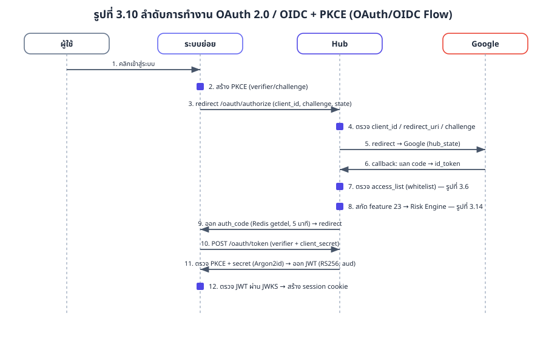

อธิบายลำดับตามรูปที่ 3.10 โดยละเอียด: เมื่อผู้ใช้คลิกเข้าสู่ระบบ (ขั้นที่ 1) ระบบย่อยจะสร้างคู่ PKCE คือ `code_verifier` และ `code_challenge` (ขั้นที่ 2) แล้ว redirect ผู้ใช้ไปยัง `/oauth/authorize` ของ Hub พร้อม `client_id`, `code_challenge` และ `state` (ขั้นที่ 3) Hub ตรวจสอบ `client_id`, `redirect_uri` และ PKCE challenge (ขั้นที่ 4) ก่อน redirect ต่อไปยัง Google พร้อม `hub_state` (ขั้นที่ 5) เมื่อผู้ใช้ยืนยันตัวตนกับ Google สำเร็จ Google จะ callback กลับมาที่ Hub และ Hub แลก `code` เป็น `id_token` (ขั้นที่ 6)

จากนั้น Hub ตรวจ `access_list`/access policy ว่าผู้ใช้มีสิทธิ์เข้าระบบย่อยนี้หรือไม่ (ขั้นที่ 7 — รูปที่ 3.6) สกัด feature 23 ตัวส่งให้ Risk Engine เพื่อตัดสินใจ `allow`/`challenge`/`block` (ขั้นที่ 8 — รูปที่ 3.14) แล้วออก `authorization_code` เก็บใน Redis แบบ atomic `getdel` อายุ 5 นาที ก่อน redirect กลับระบบย่อย (ขั้นที่ 9) ระบบย่อยนำ `code` มาแลก token แบบ server-to-server ที่ `/oauth/token` พร้อม `code_verifier` และ `client_secret` (ขั้นที่ 10) Hub ตรวจ PKCE verifier ด้วย `hmac.compare_digest` และตรวจ `client_secret` ด้วย Argon2id แล้วออก JWT (RS256, `aud=client_id`) (ขั้นที่ 11) สุดท้ายระบบย่อยตรวจสอบ signature ของ JWT ผ่าน JWKS ของ Hub แล้วสร้าง session ของตนเองด้วย signed cookie (ขั้นที่ 12 — รายละเอียดในหัวข้อ 3.7.2)

สำหรับการ login เข้า Hub โดยตรง (Hub-direct login) ใช้ flow เดียวกันแต่ตัด PKCE/ระบบย่อยออก และจำกัดสิทธิ์เฉพาะอาจารย์ เจ้าหน้าที่ และผู้ดูแลระบบเท่านั้น — นักศึกษาจะถูกปฏิเสธตั้งแต่ขั้น callback (ไม่ได้รับ JWT สำหรับ Hub-direct เลย) ซึ่งเป็นมาตรการ defense-in-depth ชั้นแรกของ RBAC

## 3.7.2 การออกและตรวจสอบ JWT (JWT Issuance & Verification)

หลังผ่าน Risk Engine แล้ว (ขั้นที่ 11 ในรูปที่ 3.10) Hub จะออก JWT แบบ RS256 พร้อม header `kid` ระบุกุญแจที่ใช้เซ็น (รองรับ key rotation) และบันทึก `jti` ไว้ใน `login_sessions` เพื่อใช้ force-revoke ภายหลัง ฝั่งระบบย่อยต้องตรวจสอบ token นี้ให้ครบถ้วนก่อนสร้าง session ของตนเอง ขั้นตอนทั้งหมดแสดงในรูปที่ 3.11

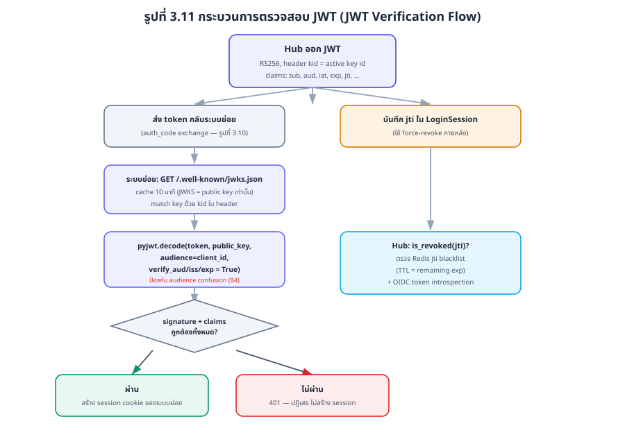

ตามรูปที่ 3.11 ระบบย่อยดึง public key จาก `GET /.well-known/jwks.json` (cache 10 นาที ลด round-trip ไปยัง Hub ทุก request) จับคู่กุญแจด้วย `kid` ใน header แล้วเรียก `pyjwt.decode(token, public_key, audience=client_id, options={"verify_aud": True, "verify_iss": True, "verify_exp": True})` การบังคับ `verify_aud=True` เป็นมาตรการป้องกัน **audience confusion** (B4) — token ที่ Hub ออกให้ระบบย่อย A จะมี `aud=client_id ของ A` เท่านั้น นำไปใช้กับระบบย่อย B ไม่ได้ ฝั่ง Hub เองก็ตรวจ `jti` กับ Redis blacklist ทุกครั้ง (`is_revoked()`) เพื่อรองรับการ force-revoke ก่อน token หมดอายุจริง (เช่น ผู้ดูแลระบบกด revoke session, หรือ user กด logout) เมื่อผ่านการตรวจสอบทั้งหมดระบบย่อยจึงสร้าง session cookie ของตนเอง (signed, HttpOnly + SameSite)

## 3.7.3 Passkey Authentication (WebAuthn)

การเข้าสู่ระบบด้วย Passkey อาศัยมาตรฐาน WebAuthn ซึ่งอุปกรณ์ของผู้ใช้ (เช่น Windows Hello, Touch ID, หรือ security key) จะเก็บ private key ไว้ในตัวอุปกรณ์ และ Hub เก็บเฉพาะ public key เท่านั้น

เมื่อผู้ใช้เลือกเข้าสู่ระบบด้วย Passkey Hub จะส่ง challenge แบบสุ่มกลับมา (ขั้นที่ 1) ผู้ใช้ยืนยันตัวตนกับอุปกรณ์ด้วย biometric หรือ PIN (ขั้นที่ 2) อุปกรณ์เซ็น challenge ด้วย private key ที่ไม่เคยออกจากตัวอุปกรณ์ (ขั้นที่ 3) Hub ตรวจสอบ signature ด้วย public key ที่เก็บไว้ พร้อมตรวจ `sign_count` เพื่อกัน credential ที่ถูก clone (ขั้นที่ 4) จากนั้นผ่าน Risk Engine เช่นเดียวกับ flow OAuth ปกติ (ขั้นที่ 5) และออก JWT (RS256) เมื่อผ่านทั้งหมด (ขั้นที่ 6) — กรณีที่ Risk Engine ตัดสินให้ต้องยืนยันเพิ่ม (step-up) แผนภาพรวมของ Passkey กับการตัดสินใจตามความเสี่ยงแสดงไว้ในรูปที่ 3.17 (หัวข้อ 3.10)

ระบบยังมีการตรวจจับ **counter regression** — หาก `sign_count` ที่อุปกรณ์ส่งมาน้อยกว่าค่าที่เคยบันทึกไว้ (สัญญาณว่า credential อาจถูก clone) ระบบจะนับและบันทึกเหตุการณ์นี้ไว้ในตาราง `passkey_credentials` เพื่อให้ผู้ดูแลระบบตรวจสอบ

## 3.7.4 Account Recovery

ในกรณีที่ผู้ใช้สูญเสียอุปกรณ์ที่ลงทะเบียน Passkey ไว้ทั้งหมด หรืออุปกรณ์/เบราว์เซอร์ของผู้ใช้ไม่รองรับ WebAuthn ระบบมีช่องทางกู้คืนบัญชี 2 รูปแบบ คือ **Backup Code** ซึ่งเป็นรหัสใช้ครั้งเดียว 10 รหัสที่สร้างให้พร้อมกับการลงทะเบียน Passkey ครั้งแรก (เก็บเป็น Argon2id hash แสดง plaintext ให้ผู้ใช้เห็นเพียงครั้งเดียว) และ **Email OTP** ซึ่งใช้ร่วมกับกลไก MFA ของระบบ ทั้งสองวิธีนี้เป็นทางเลือกเดียวที่ออกแบบไว้สำหรับการกู้คืนบัญชี — ระบบจะ**ไม่**ลดระดับความปลอดภัยกลับไปใช้รหัสผ่านธรรมดา (password fallback) เพื่อรักษาคุณสมบัติ phishing-resistant ของ Passkey ไว้ (ดูรายละเอียดเพิ่มเติมในหัวข้อ 3.10)

## 3.7.5 ภาพรวมทั้งกระบวนการ (Login Sequence)

สรุปรวมทุกวิธีข้างต้นเป็นลำดับเดียว ตั้งแต่ผู้ใช้กดเข้าสู่ระบบจนถึงผลลัพธ์ทั้งสามแบบ (อนุญาต / ต้องยืนยันเพิ่ม / ปฏิเสธ) ซึ่งครอบคลุม flow ผ่าน Google และเชื่อมโยงไปยังผลการประเมินความเสี่ยงจาก Hybrid RBA (รูปที่ 3.14) แสดงเป็นแผนภาพลำดับ (sequence diagram) ในรูปที่ 3.12

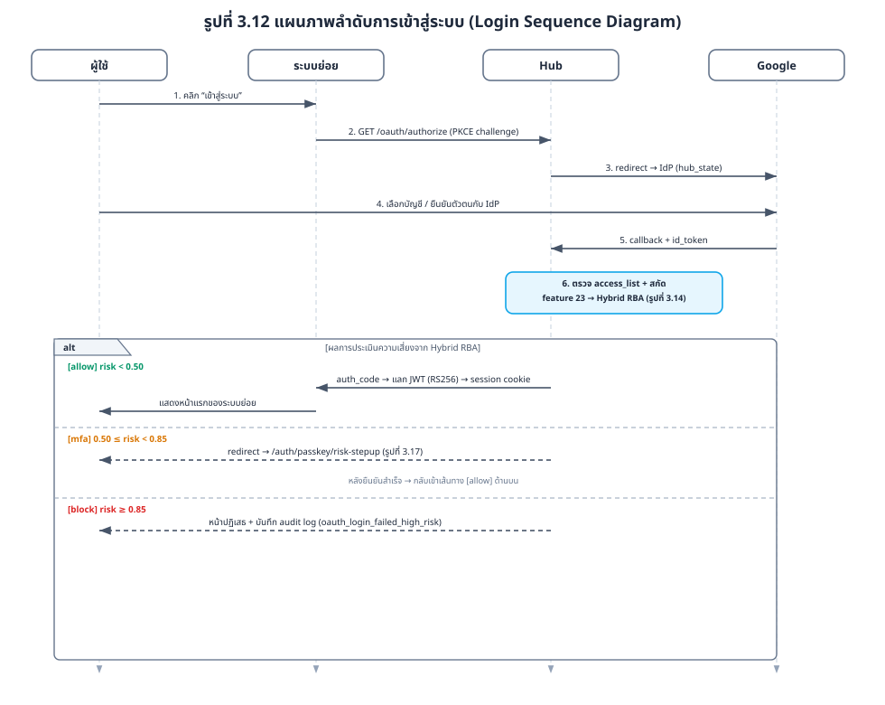

จากรูปที่ 3.12 เมื่อผลการประเมิน `allow` ระบบย่อยแลก `auth_code` เป็น JWT ทันทีและแสดงหน้าแรก เมื่อ `mfa` (challenge) ผู้ใช้ต้อง redirect ไปยืนยันตัวตนซ้ำที่ `/auth/passkey/risk-stepup` ก่อน (รูปที่ 3.17) แล้วจึงย้อนกลับเข้าเส้นทาง `allow` และเมื่อ `block` ระบบจะปฏิเสธทันทีพร้อมบันทึก audit log — ทั้งสามเส้นทางใช้กลไกเดียวกันไม่ว่าผู้ใช้จะเลือกยืนยันตัวตนด้วย Google หรือ Passkey

---

# 3.8 การออกแบบระบบ Risk-Based Authentication

ระบบใช้ **Hybrid Risk-Based Authentication แบบ 4 ชั้น** ซึ่งพัฒนาต่อยอดจากการใช้ Isolation Forest เพียงชั้นเดียว เพื่อเพิ่มความแม่นยำ ลด false positive และทำให้ผลการตัดสินใจสามารถอธิบายได้ (explainable) แนวคิดอ้างอิงจากงานวิจัยของ Freeman et al. (2016), Wiefling et al. (2020, 2022) และแนวทาง F-RBA (2024)

ก่อนหน้านี้ระบบใช้ Isolation Forest เพียงชั้นเดียวตัดสินใจตรงๆ (สกัด feature 12 ตัว → เรียก ml-service ครั้งเดียว → threshold คงที่ที่ 0.70/0.40) ไม่มีชั้นกฎ ไม่มีการเทียบพฤติกรรมส่วนบุคคล และให้แค่ผลลัพธ์ allow/mfa/block โดยไม่รู้สาเหตุ รูปที่ 3.13 เปรียบเทียบระบบเดิมกับ Hybrid RBA 4 ชั้นที่ใช้อยู่ปัจจุบัน

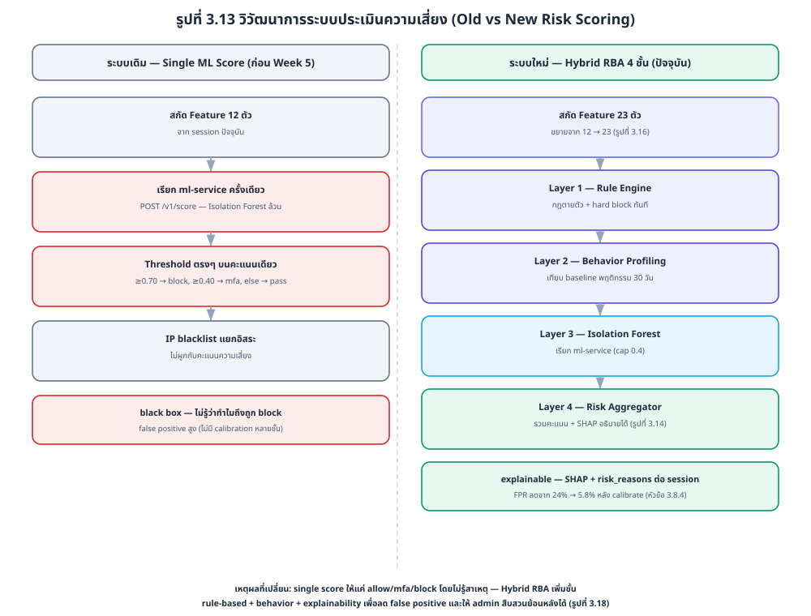

จากรูปที่ 3.13 การเปลี่ยนแปลงหลักคือ (1) ขยาย feature จาก 12 เป็น 23 ตัว (2) เพิ่มชั้น Rule Engine และ Behavior Profiling ก่อนถึง Isolation Forest ทำให้จับ known-attack ได้ทันทีโดยไม่ต้องรอ ML (3) Isolation Forest ถูก cap คะแนนไว้ที่ 0.4 เพื่อไม่ให้ครอบงำผลรวม และ (4) เพิ่ม SHAP TreeExplainer ทำให้ทุกการตัดสินใจอธิบายได้ (`risk_breakdown`, `risk_reasons`) ซึ่งเป็นพื้นฐานของ Incident Response ในหัวข้อ 3.10.1 การเปลี่ยนแปลงนี้ลด False Positive Rate จาก 24% เหลือ 5.8% บนข้อมูลจริงหลัง calibrate (หัวข้อ 3.8.4)

ภาพรวมของ flow การประเมินความเสี่ยงในระบบใหม่แสดงในรูปที่ 3.14 โดยแต่ละชั้นให้คะแนนความเสี่ยงแยกกัน ก่อนนำมารวมและตัดสินใจในชั้นสุดท้าย

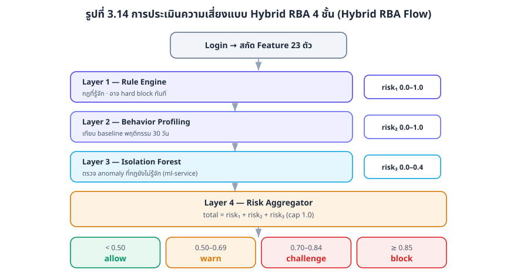

ตามรูปที่ 3.14 เมื่อมีการ login ระบบจะสกัด feature 23 ตัวก่อน จากนั้นส่งเข้า 3 ชั้นแรกที่ให้คะแนนแยกกัน (Rule Engine ให้ `risk₁` ในช่วง 0.0–1.0 และอาจ hard block ทันที, Behavior Profiling ให้ `risk₂` 0.0–1.0, Isolation Forest ให้ `risk₃` 0.0–0.4) แล้ว Layer 4 (Risk Aggregator) รวมคะแนนทั้งสาม (cap ที่ 1.0) เป็นคะแนนเดียวเพื่อตัดสินใจ: ต่ำกว่า 0.50 → `allow`, 0.50–0.69 → `warn`, 0.70–0.84 → `challenge` และตั้งแต่ 0.85 → `block` ค่า threshold เหล่านี้ผ่านการ calibrate จากข้อมูลจริง (อธิบายในหัวข้อ 3.8.4)

## 3.8.1 Layer 1 — Rule Engine

ชั้นแรกใช้กฎที่กำหนดไว้ล่วงหน้าเพื่อจับการโจมตีที่รู้จักได้ทันทีโดยไม่ต้องรอผลจาก ML แบ่งเป็นกฎที่ทำให้ปฏิเสธการเข้าสู่ระบบในทันที (hard block, คะแนน = 1.0) และกฎที่สะสมเป็นคะแนนความเสี่ยง

กฎ hard block ได้แก่ จำนวนการ login ผิดพลาดใน 24 ชั่วโมงตั้งแต่ 10 ครั้งขึ้นไป (สัญญาณ brute-force / credential stuffing ตาม NIST SP 800-63B-4), จำนวนการ login สำเร็จใน 24 ชั่วโมงตั้งแต่ 50 ครั้งขึ้นไป (สัญญาณ bot), การเปลี่ยนประเทศมากกว่า 8 ครั้งใน 30 วัน, การเข้าจาก IP ที่อยู่ใน blacklist และที่สำคัญคือ **Impossible Travel** — กรณีที่ session ก่อนหน้าและ session ปัจจุบันมาจากคนละประเทศ แต่ระยะเวลาห่างกันน้อยกว่า 1 ชั่วโมง (ตรวจสอบเฉพาะกรณีที่ GeoIP resolve ประเทศได้ทั้งคู่)

ส่วนกฎที่สะสมคะแนน (รวมกันได้สูงสุด 1.0) ได้แก่ การใช้อุปกรณ์ใหม่ (+0.30), การ login จากประเทศใหม่ (+0.30), การใช้ user agent family ใหม่ เช่น เปลี่ยนจาก Chrome เป็น Firefox (+0.20), การ login ผิดพลาดตั้งแต่ 3 ครั้งใน 24 ชั่วโมง (+0.20), การ login จากนอกประเทศไทย (+0.10 — เป็น rule เฉพาะของบริบทมหาวิทยาลัยไทย) และการพบ IP เดียวกันถูกใช้ login เข้าบัญชีที่แตกต่างกันมากกว่า 5 บัญชีภายใน 1 ชั่วโมง (+0.25 — สัญญาณ credential stuffing ตาม OWASP API4:2023)

## 3.8.2 Layer 2 — Behavior Profiling

ชั้นที่สองเปรียบเทียบพฤติกรรมของ session ปัจจุบันกับ baseline พฤติกรรมปกติของผู้ใช้คนนั้นในช่วง 30 วันที่ผ่านมา โดยใช้ feature ชุดเดียวกับที่สกัดไว้แล้วสำหรับ ML แต่ให้คะแนนแยกออกมาเป็นอีกสัญญาณหนึ่ง (double signal) เพื่อลด false negative

คะแนนความเสี่ยงของชั้นนี้พิจารณาจากส่วนต่างระหว่างเวลา login ปัจจุบันกับเวลาที่ผู้ใช้คนนั้น login เป็นประจำ — หากต่างกันตั้งแต่ 10 ชั่วโมงขึ้นไปจะได้ +0.40 และหากต่างกันตั้งแต่ 6 ชั่วโมงขึ้นไปจะได้ +0.20 นอกจากนี้การ login จากประเทศใหม่ได้ +0.30 อุปกรณ์ใหม่ได้ +0.20 และการ login ในวันหยุดสุดสัปดาห์ที่ผิดไปจากพฤติกรรมปกติได้ +0.10 ส่วนผู้ใช้ใหม่ที่ยังไม่มีประวัติเพียงพอ (cold start) จะได้คะแนนคงที่ 0.20 โดยกำหนดเกณฑ์ขั้นต่ำของจำนวน session ที่ต้องมีก่อนจะเริ่มคำนวณ personalize ไว้ที่ 5 session (`MIN_HISTORY_FOR_PERSONALIZATION`)

## 3.8.3 Layer 3 — Isolation Forest

ชั้นที่สามใช้แบบจำลอง **Isolation Forest** (Liu, Ting, Zhou, 2008) เพื่อตรวจจับพฤติกรรมที่ผิดปกติในรูปแบบที่ Rule Engine และ Behavior Profiling ยังไม่รู้จัก โดยรับ feature ทั้ง 23 ตัวจาก Hub ผ่าน HTTP ไปยัง ML Verifier ซึ่งเป็น service แยก (`/v1/score`) ผลคะแนน anomaly ที่ได้จาก Isolation Forest จะถูก mapping เป็นคะแนนความเสี่ยงของชั้นนี้: ค่า anomaly ตั้งแต่ 0.7 ขึ้นไปได้ +0.40, ตั้งแต่ 0.5 ขึ้นไปได้ +0.20, ตั้งแต่ 0.3 ขึ้นไปได้ +0.10 และต่ำกว่า 0.3 ไม่ได้คะแนนเพิ่ม

การเรียกใช้ ML Verifier ออกแบบให้ **fail-safe ต่อความล้มเหลว** — หากบริการ ML ไม่ตอบสนองหรือเกิด exception ใด ๆ Hub จะได้รับค่า default (score = 0.0, decision = pass) กลับมาแทนเสมอ เพื่อไม่ให้ความผิดพลาดของ ML ส่งผลให้ทั้งระบบ Hub ล่มหรือผู้ใช้ทุกคน login ไม่ได้

## 3.8.4 Layer 4 — Risk Aggregator

ชั้นสุดท้ายรวมคะแนนจากทั้งสามชั้น (cap ไว้ที่ 1.0) เป็นคะแนนเดียว แล้วตัดสินใจตามช่วงคะแนนดังนี้: คะแนนตั้งแต่ 0.85 ขึ้นไปจะถูก **block** ทันที คะแนนระหว่าง 0.70–0.84 จะเข้าสู่กระบวนการ **challenge** (ยืนยันตัวตนเพิ่มเติม รายละเอียดในหัวข้อ 3.10) คะแนนระหว่าง 0.50–0.69 จะ **warn** คือยังอนุญาตให้เข้าสู่ระบบแต่บันทึก log เพื่อเฝ้าระวัง และคะแนนต่ำกว่า 0.50 จะ **allow** ตามปกติ

ค่า threshold เหล่านี้ถูก calibrate จากการวิเคราะห์ distribution ของ risk score จริง (`scripts/calibrate_thresholds.py`) พบว่า normal user ที่ผ่าน Isolation Forest มักได้คะแนนรวมอยู่ที่ p90 ≈ 0.60 และ p95 ≈ 0.70 ดังนั้น threshold challenge ที่ 0.70 (ไม่ใช่ 0.50 ที่ใช้เป็นค่าเริ่มต้น) ทำให้ False Positive Rate ลดลงจาก 24% เหลือ 5.8% บนชุดข้อมูลจริง

ในช่วงที่ระบบทำงานแบบ **Shadow Mode** (`ML_SHADOW_MODE=true`) การตัดสินใจในระดับ warn, challenge และ block จะไม่ถูก enforce จริง แต่จะถูกบันทึกเป็น `would_warn` / `would_challenge` / `would_block` เพื่อให้สามารถวิเคราะห์ว่าหากเปิดใช้งานจริงแล้วระบบจะ challenge หรือ block ผู้ใช้กี่ครั้ง และเพื่อ calibrate threshold ให้เหมาะสมก่อน enforce จริง (กระบวนการ calibration นี้นำไปสู่การปรับ threshold challenge จาก 0.50 → 0.70 ดังที่กล่าวข้างต้น)

---

# 3.9 การพัฒนาโมเดล Machine Learning

การพัฒนาโมเดลดำเนินตามขั้นตอนมาตรฐานของงาน Machine Learning ตั้งแต่การสร้างชุดข้อมูล การเตรียมข้อมูลและสร้างคุณลักษณะ (feature engineering) การฝึกโมเดล ไปจนถึงการนำโมเดลไปให้บริการพร้อมอธิบายผลด้วย SHAP ดังแสดงในรูปที่ 3.15 หัวข้อย่อยถัดไปอธิบายรายละเอียดของแต่ละขั้น

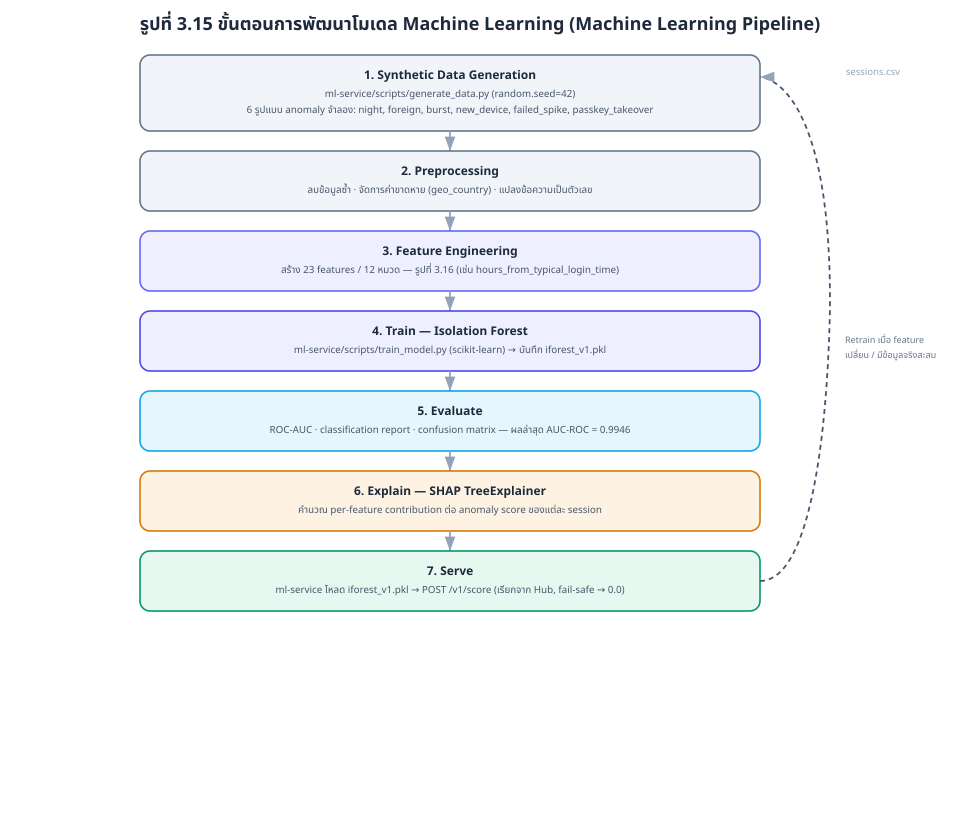

จากรูปที่ 3.15 จุดเริ่มต้นคือการสร้างชุดข้อมูลจำลอง (ไม่ใช่ raw log จริง เพราะระบบยังไม่มีข้อมูล login สะสมมากพอ) แล้วผ่านการเตรียมข้อมูล สร้างคุณลักษณะ ฝึกโมเดล ประเมินผล อธิบายผลด้วย SHAP ก่อนนำไปให้บริการจริงที่ ml-service — เส้นประแสดงวงจร retrain เมื่อ feature เปลี่ยนแปลงหรือมีข้อมูลจริงสะสมมากพอ

## 3.9.1 ชุดข้อมูล

ต้องแยกบทบาทของตาราง `login_sessions` กับชุดข้อมูลฝึกโมเดลออกจากกันให้ชัดเจน

**`login_sessions` (runtime feature source)** — ตารางนี้ถูกใช้โดย `feature_extraction.py` ในเวลา runtime เพื่อ query ประวัติการ login ย้อนหลังของผู้ใช้แต่ละคน เพื่อคำนวณฟีเจอร์ที่ต้องพึ่งพา baseline เช่น `hours_from_typical_login_time` (เวลา login ปัจจุบันต่างจากเวลา median ของผู้ใช้คนนั้นเท่าใด), `login_count_24h`, `country_change_count_30d`, `concurrent_session_count` เป็นต้น ข้อมูลใน `login_sessions` **ไม่ใช่** ชุดข้อมูลสำหรับฝึกโมเดลโดยตรง

**ชุดข้อมูลฝึกโมเดล (synthetic training data)** — เนื่องจากระบบยังไม่มีข้อมูล login จริงสะสมมากพอ และไม่มี label "การโจมตี" จากสภาพแวดล้อมจริง ชุดข้อมูลสำหรับฝึกโมเดลจึงสร้างด้วยสคริปต์ `ml-service/scripts/generate_data.py` ซึ่งผลิตไฟล์ `sessions.csv` ที่มี session ปกติ (normal) และ session ที่ถูก label ว่าผิดปกติ (anomaly) จาก 6 รูปแบบการโจมตีจำลอง ได้แก่ night (login กลางดึก), foreign (login ต่างประเทศ), burst (login ถี่ผิดปกติ), new_device (อุปกรณ์ใหม่ทันที), failed_spike (failed login พุ่งสูง) และ passkey_takeover (พยายาม takeover บัญชีที่มี Passkey) โดยใช้ `random.seed(42)` เพื่อให้ผลทำซ้ำได้

## 3.9.2 การเตรียมข้อมูล

ก่อนนำข้อมูลไปฝึกโมเดล มีการลบข้อมูลซ้ำ จัดการค่าที่ขาดหาย (เช่น `geo_country` ที่ยังไม่สามารถ resolve ได้) แปลงข้อมูลประเภทข้อความเป็นตัวเลข (เช่น user agent family) และทำ feature engineering เพื่อให้ได้ feature ที่สื่อความหมายต่อพฤติกรรมการเข้าสู่ระบบ เช่น คำนวณส่วนต่างของเวลาเข้าสู่ระบบจากเวลาปกติของผู้ใช้คนนั้น (`hours_from_typical_login_time`)

## 3.9.3 การสร้างคุณลักษณะ (Feature Engineering)

โมเดลใช้ feature ทั้งหมด **23 ตัว** (ขยายจาก 17 ตัวในช่วงต้น โดยตัด 2 ตัวที่ collinear 100% ออก และเพิ่มใหม่ 8 ตัว) ทุกตัวมีที่มาจากงานวิจัยที่อ้างอิงได้ แบ่งเป็น 12 หมวด ดังแสดงในรูปที่ 3.16 และตารางด้านล่าง

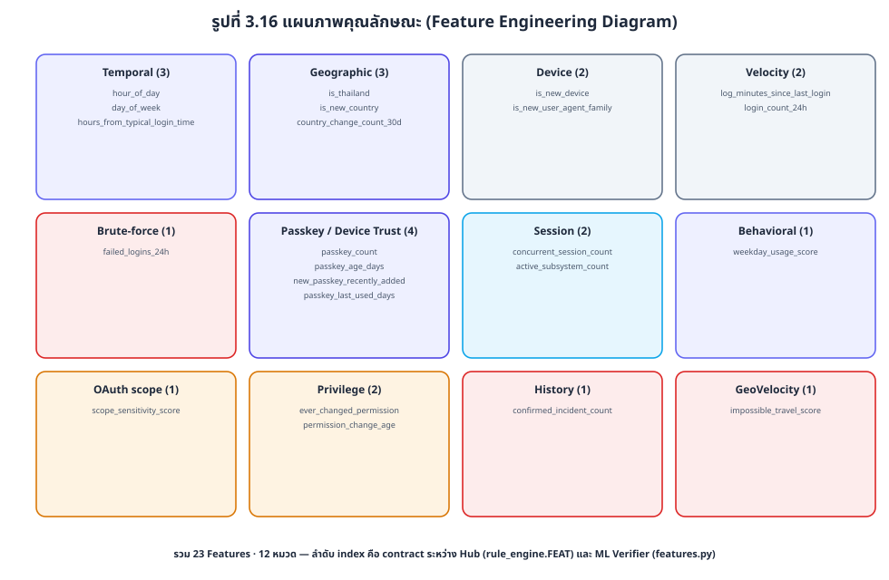

| หมวด | จำนวน | Feature | อ้างอิง |
|---|---|---|---|
| **Temporal** (เวลา) | 3 | `hour_of_day`, `day_of_week`, `hours_from_typical_login_time` | Wiefling 2020, 2022 |
| **Geographic** (ภูมิศาสตร์) | 3 | `is_thailand`, `is_new_country`, `country_change_count_30d` | Wiefling 2022, Freeman 2016 |
| **Device** (อุปกรณ์) | 2 | `is_new_device`, `is_new_user_agent_family` | Laperdrix 2020, Iqbal 2021 |
| **Velocity** (ความถี่) | 2 | `log_minutes_since_last_login`, `login_count_24h` | Microsoft Entra, Acien 2021 |
| **Brute-force** | 1 | `failed_logins_24h` | NIST SP 800-63B-4 |
| **Passkey / Device Trust** | 4 | `passkey_count`, `passkey_age_days`, `new_passkey_recently_added`, `passkey_last_used_days` | สัปดาห์ที่ 9 — Passkey ใหม่ <1h เป็นสัญญาณ takeover |
| **Session** (concurrent) | 2 | `concurrent_session_count`, `active_subsystem_count` | Lateral movement detection |
| **Behavioral** (personalized) | 1 | `weekday_usage_score` | Wiefling 2022 (แทน is_weekend ที่ collinear กับ day_of_week) |
| **OAuth scope** | 1 | `scope_sensitivity_score` | OWASP API Security — scope ที่ sensitive สูงกว่าเพิ่มความเสี่ยง |
| **Privilege** | 2 | `ever_changed_permission`, `permission_change_age` | แยก sentinel 9999 เป็น 2 ตัวกัน outlier ใน tree |
| **History** | 1 | `confirmed_incident_count` | Ground-truth incident จากอดีต |
| **GeoVelocity** | 1 | `impossible_travel_score` | Microsoft Entra — เปลี่ยนประเทศเร็วผิดปกติ (ไม่ต้องพึ่ง lat/lon) |

**หมายเหตุเรื่อง is_weekend และ has_passkey** — ทั้งสองตัวถูกตัดออกเนื่องจาก collinear 100% กับ feature อื่น (`is_weekend = f(day_of_week)`, `has_passkey = f(passkey_count > 0)`) การเก็บ feature ที่ collinear ไว้ใน Isolation Forest ทำให้น้ำหนักของมิตินั้นเพิ่มสองเท่าโดยไม่มีข้อมูลเพิ่มเติม

ลำดับของ feature ทั้ง 23 ตัวถือเป็น **"ข้อตกลงร่วม" (contract)** ระหว่าง Hub และ ML Verifier — กำหนดไว้ใน `ml-service/app/features.py:FEATURE_NAMES` และ `hub/backend/app/security/rule_engine.py:FEAT` ต้องตรงกันทุกครั้ง (B27/B49) เพราะ Isolation Forest อ่าน feature ตาม index ตำแหน่ง ถ้าลำดับไม่ตรงแม้แต่ตำแหน่งเดียวทำให้ score มั่วทันที

## 3.9.4 การเลือกและฝึกโมเดล

โมเดลที่เลือกใช้คือ **Isolation Forest** จากไลบรารี scikit-learn ซึ่งเหมาะกับลักษณะข้อมูลของระบบที่ session ผิดปกติเกิดขึ้นน้อยมากเมื่อเทียบกับ session ปกติ และไม่มี label ของ "การโจมตี" ในข้อมูลจริง การฝึกโมเดลทำผ่านสคริปต์ `train_model.py` ซึ่งจะอ่านข้อมูลที่ผ่านการเตรียมแล้ว ฝึกโมเดลด้วย feature ทั้ง 23 ตัว แล้วบันทึกเป็นไฟล์ `iforest_v1.pkl` สำหรับให้ ML Verifier โหลดใช้งาน

## 3.9.5 การประเมินผล

การประเมินผลโมเดลใช้ข้อมูลทดสอบที่มี synthetic label กำกับไว้ โดยวัดผลด้วย **ROC-AUC**, classification report (Precision, Recall, F1-Score) และ confusion matrix ที่ threshold ต่าง ๆ ผลการประเมินล่าสุดหลังขยาย feature ครบ 23 ตัว (รวมกลุ่ม Passkey) ได้ค่า **AUC-ROC อยู่ที่ 0.9946** ซึ่งบ่งชี้ว่าโมเดลสามารถแยกแยะ session ปกติออกจาก session ที่มีลักษณะผิดปกติได้ดีมากในข้อมูลทดสอบชุดนี้

## 3.9.6 การอธิบายผลลัพธ์ด้วย SHAP

เพื่อให้ผลของโมเดลไม่เป็น "black box" ระบบใช้ **SHAP TreeExplainer** (Lundberg & Lee, 2017) คำนวณ contribution ของแต่ละ feature ต่อคะแนน anomaly ของ session นั้น ๆ ผลลัพธ์จะถูกส่งกลับไปแสดงในหน้า Admin Dashboard เป็นแถบกราฟ (bar) ที่แสดงว่า feature ใดผลักคะแนนความเสี่ยงให้สูงขึ้นหรือต่ำลง เช่น "is_new_device (+0.30)" หรือ "hours_from_typical_login_time=12 (+0.40)" ทำให้ผู้ดูแลระบบสามารถเข้าใจเหตุผลของการตัดสินใจในแต่ละ session ได้ ไม่ใช่เห็นแค่ตัวเลขคะแนนเพียงอย่างเดียว ค่า `risk_breakdown` และ `risk_reasons` เหล่านี้ถูกบันทึกไว้ใน `login_sessions` ทุกครั้งเพื่อใช้ตรวจสอบย้อนหลังด้วย

---

# 3.10 การออกแบบ Step-Up Authentication และ Risk-Triggered MFA

เมื่อ Risk Aggregator (Layer 4) ประเมินว่า session หนึ่งอยู่ในระดับ **challenge** (คะแนนรวม 0.50–0.84) หรือ **block** (คะแนนรวม ≥ 0.85) ระบบจะดำเนินการยืนยันตัวตนเพิ่มเติมตามเงื่อนไขดังต่อไปนี้ ซึ่งเป็นส่วนที่ถูก "wire" ให้ใช้งานได้จริงในสัปดาห์ที่ 9–10 ต่อจากที่ scaffold ไว้ก่อนหน้า

ภาพรวมของกลไกนี้ ตั้งแต่ผลคะแนนความเสี่ยงจาก Hybrid RBA ไปจนถึงการยืนยันตัวตนซ้ำด้วย Passkey หรือ Email OTP และการออก JWT แสดงเป็นแผนภาพในรูปที่ 3.17

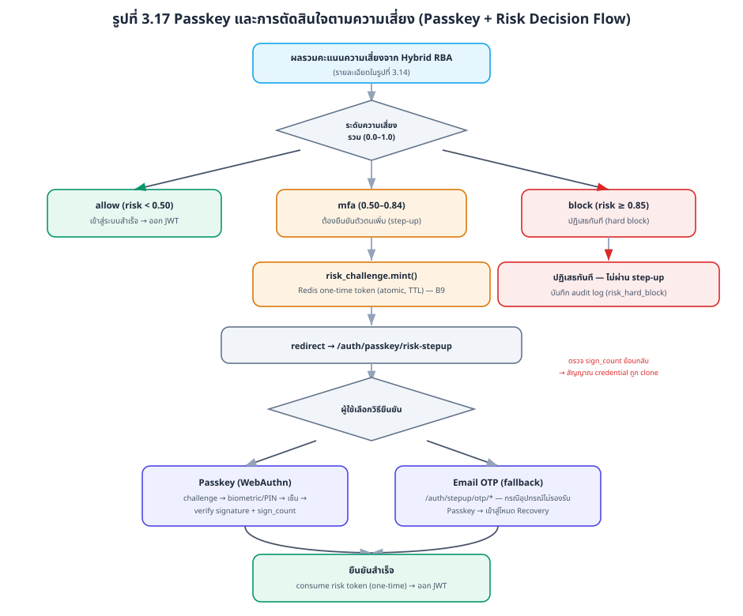

- **คะแนนรวม ≥ 0.85 → Block** การเข้าสู่ระบบจะถูกปฏิเสธทันที (decision = block) การตัดสินใจระดับนี้ถูกกำหนดให้เกิดขึ้นที่จุดเดียวคือ finalizer ของ flow OAuth/Hub-direct เพื่อให้เป็น single source of truth (ไม่กระจายไปแก้ที่ threshold ของ aggregator)
- **คะแนนรวม 0.50–0.84 และผู้ใช้มี Passkey อยู่แล้ว → Passkey Re-Authentication** ระบบจะสร้าง challenge แบบใช้ครั้งเดียว (เก็บใน Redis, อายุ 5 นาที, ใช้ atomic `getdel` เพื่อป้องกัน replay) แล้วพาผู้ใช้ไปยังหน้า re-authentication ที่ Hub ให้บริการเอง ผู้ใช้ต้องยืนยันตัวตนด้วย Passkey อีกครั้งก่อนที่ระบบจะออก token ให้
- **คะแนนรวม 0.50–0.84, ผู้ใช้ยังไม่มี Passkey, และอยู่ใน Grace Period (บัญชีอายุไม่เกิน 7 วัน) → Allow Once + Banner** ระบบจะอนุญาตให้เข้าสู่ระบบได้ตามปกติ แต่บันทึก log และส่งจำนวนวันที่เหลือของ grace period ไปแสดงเป็น banner เตือนในระบบย่อย เพื่อกระตุ้นให้ผู้ใช้ลงทะเบียน Passkey โดยเร็ว ค่า grace period นี้คำนวณจาก `created_at` ของผู้ใช้แบบ runtime เสมอ ไม่ได้เก็บเป็น flag แยก เพื่อไม่ให้ข้อมูลไม่ตรงกันหากมีการแก้ไขในอนาคต
- **คะแนนรวม 0.50–0.84, ผู้ใช้ยังไม่มี Passkey, และพ้น Grace Period แล้ว → Force Enrollment** ผู้ใช้จะถูกบังคับให้ผ่านขั้นตอนยืนยันด้วย Email OTP ก่อน (ป้องกันไม่ให้ผู้โจมตีที่ขโมย session มาได้ลงทะเบียน Passkey ของตัวเองแทนเจ้าของบัญชี) จากนั้นจึงเข้าสู่ขั้นตอนลงทะเบียน Passkey ใหม่แบบบังคับ เมื่อสำเร็จระบบจะออก backup code ให้ทันที
- **กรณีเบราว์เซอร์/อุปกรณ์ไม่รองรับ WebAuthn → Account Recovery** ระบบจะไม่ลดระดับความปลอดภัยกลับไปใช้ช่องทาง Email OTP login แทน แต่จะนำผู้ใช้ไปสู่กระบวนการ Account Recovery (backup code หรือ email-based recovery) เพื่อคงคุณสมบัติ phishing-resistant ของรูปแบบ Passkey ไว้

ในเชิงการพัฒนา การตัดสินใจของ Step-Up Authentication ทั้งหมดใช้ pattern เดียวกันคือสร้าง "risk challenge" แบบ one-time token ใน Redis ที่บรรทุก (payload) ข้อมูลที่จำเป็น เช่น `user_id`, คะแนนความเสี่ยง, เหตุผล, ผู้ให้บริการ IdP และประเภทของ flow (`reauth` หรือ `enroll`) — token นี้จะถูก consume แบบ atomic ทันทีหลังการยืนยันตัวตนผ่าน เพื่อป้องกันการนำ challenge เดิมมาใช้ซ้ำ (replay attack)

## 3.10.1 การตรวจสอบและตอบสนองต่อเหตุการณ์ (Incident Response)

ผลลัพธ์ของ Hybrid RBA ทุก session (`risk_score`, `decision`, `risk_breakdown` ที่รวม SHAP explanation) ที่บันทึกไว้ใน `login_sessions` ถูกนำมาใช้ต่อในหน้า **Incident Triage** ของ Admin Console เพื่อให้ผู้ดูแลระบบสืบสวนและตอบสนองต่อ session ที่มีความเสี่ยงได้โดยไม่ต้องไล่อ่าน log ดิบ ระบบไม่มีตาราง `incident` แยกต่างหาก — ทุกอย่างถูก derive สดจาก `login_sessions` และ `audit_logs` ขั้นตอนทั้งหมดแสดงในรูปที่ 3.18

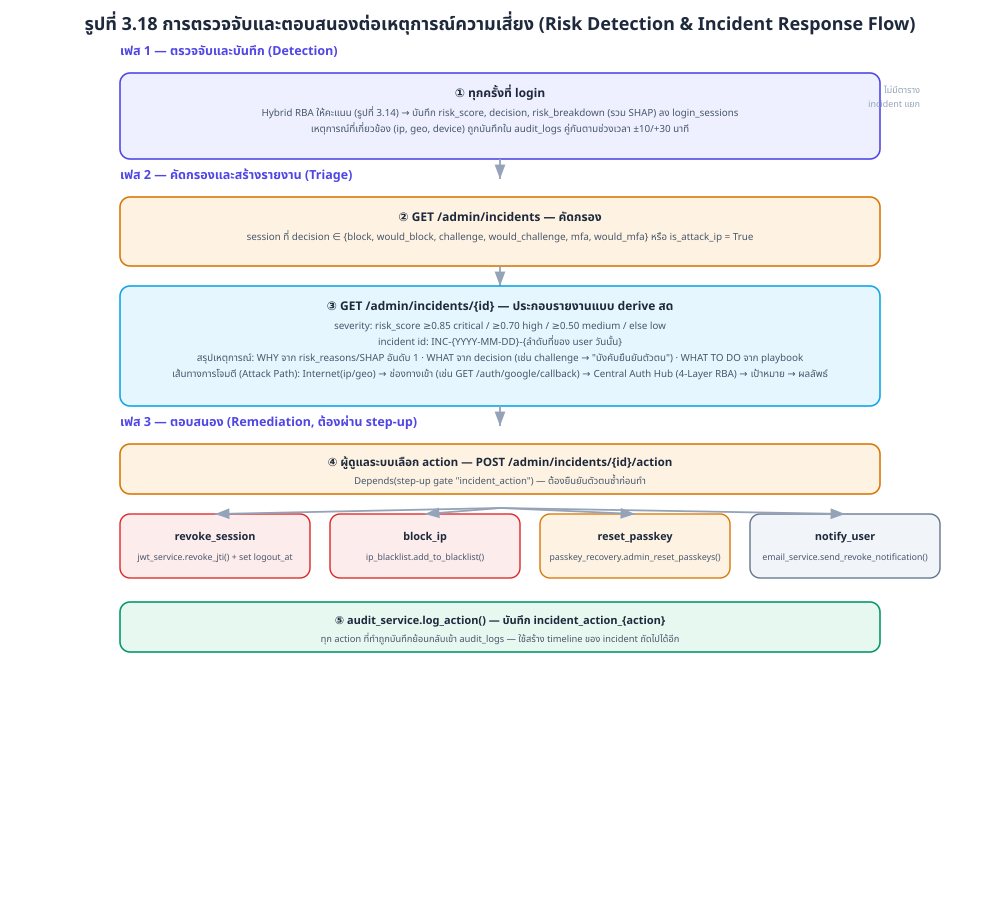

ตามรูปที่ 3.18 เมื่อมีการ login ทุกครั้ง (①) ผลการประเมินจาก Hybrid RBA และเหตุการณ์ที่เกี่ยวข้องในช่วง ±10/+30 นาทีจาก `audit_logs` จะถูกบันทึกไว้เป็นวัตถุดิบ `GET /admin/incidents` (②) คัดกรอง session ที่ `decision` อยู่ในกลุ่มเสี่ยง (`block`/`would_block`/`challenge`/`would_challenge`/`mfa`/`would_mfa`) หรือมาจาก IP ที่เคยโจมตี ก่อนที่ `GET /admin/incidents/{id}` (③) จะประกอบรายงานแบบสดขึ้นมา ได้แก่ ระดับความรุนแรง (risk_score ≥0.85 = critical, ≥0.70 = high, ≥0.50 = medium, ต่ำกว่านั้น = low), รหัสเหตุการณ์รูปแบบ `INC-{วันที่}-{ลำดับ}`, สรุปเหตุการณ์ 3 ส่วน (**WHY** จากเหตุผลอันดับ 1 ใน `risk_reasons`/SHAP, **WHAT** จาก action ที่ระบบตอบสนองไปแล้วตาม `decision`, **WHAT TO DO** จาก playbook การแก้ไข) และเส้นทางการโจมตี (Attack Path) ที่ไล่จาก IP ต้นทาง ผ่านช่องทางเข้า (เช่น Google OAuth callback) เข้าสู่ Central Auth Hub ที่ประเมินความเสี่ยง ไปจนถึงเป้าหมายและผลลัพธ์สุดท้าย

เมื่อผู้ดูแลระบบเลือกดำเนินการ (④) คำขอ `POST /admin/incidents/{id}/action` ต้องผ่าน step-up gate เดียวกับที่ใช้ป้องกันการลงทะเบียนระบบย่อย (หัวข้อ 3.5.6) ก่อนจึงจะเรียก action จริงได้ ได้แก่ **revoke_session** (เพิกถอน `jti` ทันทีผ่านกลไกเดียวกับหัวข้อ 3.7.2), **block_ip** (เพิ่ม IP เข้า blacklist), **reset_passkey** (บังคับผู้ใช้ลงทะเบียน Passkey ใหม่) และ **notify_user** (แจ้งเตือนทางอีเมล) ทุก action ที่ทำถูกบันทึกกลับเข้า `audit_logs` (⑤) ในชื่อ `incident_action_{action}` ทำให้เหตุการณ์ที่เพิ่งตอบสนองไปกลายเป็นส่วนหนึ่งของ timeline สำหรับการสืบสวนครั้งถัดไปได้เช่นกัน

---

# 3.11 การทดสอบระบบ

การทดสอบระบบดำเนินการตามแนวทาง **Test-Driven Development (TDD)** คือเขียน test ก่อนเขียน implementation เสมอ (RED → GREEN → REFACTOR) และห้าม commit งานหากยังมี test ที่ไม่ผ่าน การทดสอบครอบคลุมหลายระดับดังนี้

## Unit Testing และ Integration Testing

ฝั่ง backend ของ Hub มีชุดทดสอบอัตโนมัติด้วย `pytest` จำนวน **189 รายการ** ครอบคลุมเกือบทุก service และ router สำคัญ เช่น การทำงานของ JWT service, secret service (Argon2id/Fernet), PKCE, RBAC (สิทธิ์ตามบทบาท), rate limiting, OIDC ระดับ L1 (discovery/userinfo/introspection ทั้งแบบเขียนเองและผ่าน Authlib), และ flow ของ Passkey ทั้งการลงทะเบียน (ceremony), การ login, การจัดการอุปกรณ์ตลอดอายุการใช้งาน (lifecycle), การกู้คืนบัญชี (recovery) และกรณีด้านความปลอดภัย (anti-enumeration) นอกจากนี้ยังมีชุดทดสอบเฉพาะสำหรับ Risk-Triggered MFA flow ที่ครอบคลุมทั้ง config, risk_challenge service, grace period, endpoint ของ re-authentication และ force enrollment รวมถึงชุดทดสอบ end-to-end ที่จำลอง flow การใช้งานแบบครบวงจร (full stack) ตั้งแต่ login จนถึงการใช้งานระบบย่อย

ฝั่ง frontend ใช้ **Playwright** สำหรับทดสอบ end-to-end ผ่านเบราว์เซอร์จริง โดยเฉพาะ flow ที่ทดสอบยากด้วย unit test เช่น OAuth redirect และการแสดงผลของ Admin Dashboard

## Security Testing

การทดสอบด้านความปลอดภัยอ้างอิงกรอบ **OWASP Top 10 (2021)** เป็นหลัก โดยตรวจสอบทุกหัวข้อว่ามีมาตรการรองรับ เช่น Broken Access Control (RBAC + `aud` check + whitelist), Cryptographic Failures (RS256, Argon2id, Fernet, HMAC-SHA256), Injection (SQLAlchemy ORM + Jinja2 auto-escape + Pydantic validation), Security Misconfiguration (ปิด `/docs` ใน production และ `validate_production()` แบบ fail-fast), Identification & Authentication Failures (OAuth+PKCE, JWT อายุสั้น, MFA) และ Security Logging & Monitoring (`request_logs`, `audit_logs`, `api_alerts`)

นอกจากนี้ยังมีการสแกนหาช่องโหว่ในไลบรารีที่ใช้ด้วย **pip-audit** ซึ่งช่วยลดจำนวนช่องโหว่จาก 28 รายการในช่วงต้นโครงการ ลงเหลือ 5 รายการที่เป็น transitive dependency และมีการรัน **OWASP ZAP Baseline Scan** กับทุก service เพื่อตรวจหา security header ที่ขาดหายและปัญหาด้าน configuration เบื้องต้น ผลการสแกนนำไปสู่การเพิ่ม `SecurityHeadersMiddleware` ที่ตั้งค่า Content-Security-Policy, HSTS, X-Frame-Options, X-Content-Type-Options และ Permissions-Policy ให้ครบทุก response

สำหรับประเด็น CSRF ได้วิเคราะห์แยกไว้โดยเฉพาะ และสรุปว่าไม่จำเป็นต้องมี CSRF token แบบดั้งเดิม เนื่องจาก Admin Console ใช้ Bearer JWT ใน header (ไม่ใช่ cookie-based session สำหรับการกระทำที่เปลี่ยนแปลงข้อมูล) และ flow OAuth ทั้งหมดมี PKCE + state token ใน Redis ซึ่ง OWASP Cheat Sheet ยอมรับว่าเป็นมาตรการป้องกัน CSRF ที่เพียงพอแล้ว

## Penetration-style Testing

สำหรับ flow ที่มีความอ่อนไหวสูง เช่น OAuth และ Passkey มีชุดทดสอบที่จำลองการโจมตีโดยตรง เช่น การพยายามใช้ authorization code ซ้ำ (token replay — ตรวจสอบด้วย Redis `getdel` แบบ atomic), การพยายาม login ด้วย Passkey ของบัญชีอื่น, การตรวจสอบว่า error message ของการ login ที่ล้มเหลวทุกกรณีมีรูปแบบเหมือนกัน (ป้องกัน user enumeration) และการตรวจสอบว่า `allowCredentials` ของ passkey login จะไม่เป็นค่าว่างแม้บัญชีนั้นไม่มี passkey จริง (ป้องกันการรั่วไหลของข้อมูลผ่าน response shape)

ผลการทดสอบทุกครั้งจะถูกบันทึกเป็นรายงานเก็บไว้ใน `tests/reports/` พร้อมวันที่และจำนวน test ที่ผ่าน/ไม่ผ่าน เพื่อให้สามารถตรวจสอบความคืบหน้าของคุณภาพระบบย้อนหลังได้

---

# 3.12 เครื่องมือที่ใช้ในการพัฒนา

## Backend

ส่วน backend ของ Hub และระบบย่อยทั้งสองพัฒนาด้วย **Python 3.11** และ **FastAPI** ร่วมกับ **SQLAlchemy** สำหรับ ORM และ **Authlib** สำหรับการเชื่อมต่อ OAuth/OIDC กับ Google ด้านการจัดการ configuration ใช้ **Pydantic Settings** ซึ่งมีฟังก์ชัน fail-fast ตรวจสอบค่าที่ไม่ปลอดภัยก่อนระบบจะ start ใน production

## ความปลอดภัยและการจัดการ Session

การเข้ารหัสรหัสผ่าน/secret ใช้ **Argon2id** (ผ่าน argon2-cffi/passlib) การเข้ารหัสข้อมูลแบบ symmetric ใช้ **Fernet** จากไลบรารี `cryptography` การเซ็น session cookie ของระบบย่อยใช้ **itsdangerous** และการจำกัดอัตราการเรียก API ใช้ **slowapi** ส่วน Passkey/WebAuthn ใช้ไลบรารีที่ implement มาตรฐาน FIDO2 ฝั่ง server

## Machine Learning

ML Verifier พัฒนาด้วย **scikit-learn** (Isolation Forest), **pandas** และ **numpy** สำหรับการเตรียมและประมวลผลข้อมูล และ **SHAP** สำหรับอธิบายผลลัพธ์ของโมเดล (TreeExplainer)

## Database และ Cache

ฐานข้อมูลหลักใช้ **PostgreSQL 15** ทั้ง 3 instance และใช้ **Redis 7** เป็น cache/session store สำหรับ OAuth state, authorization code, MFA challenge และ risk challenge แบบ one-time token

## Frontend

Admin Dashboard พัฒนาด้วย **Next.js 14 (App Router)** และ **TypeScript** ตกแต่งด้วย **Tailwind CSS** ส่วนระบบย่อยใช้ Jinja2 templates ร่วมกับ Tailwind (ระบบหอพักธีม Bauhaus, ระบบห้องสมุดธีม vintage) และระบบหอพักมีส่วนหน้าเว็บแบบ React SPA เพิ่มเติม

## Infrastructure และ Testing

การ deploy ใช้ **Docker Compose** แยกเป็น 3 stack (`cah-hub`, `cah-dorm`, `cah-library`) เชื่อมต่อผ่าน external network `cah-net` และใช้ **Caddy** เป็น reverse proxy พร้อม TLS อัตโนมัติ (Let's Encrypt) ในสภาพแวดล้อม production การทดสอบอัตโนมัติใช้ **pytest** สำหรับ backend และ **Playwright** สำหรับ end-to-end บน frontend ส่วน CI ใช้ **GitHub Actions** รันชุดทดสอบทุกครั้งที่มีการ push โค้ด

---

# 3.13 สรุปบทที่ 3

บทนี้ได้นำเสนอวิธีดำเนินงานของโครงการ Central Auth Hub ตามแนวทาง Secure SDLC ตั้งแต่การวิเคราะห์ความต้องการและภัยคุกคามด้วย STRIDE การออกแบบสถาปัตยกรรมแบบ 3-stack ที่จำลองการแยกความรับผิดชอบของแต่ละระบบย่อย การออกแบบฐานข้อมูล PostgreSQL ทั้ง 3 instance การพัฒนาระบบยืนยันตัวตนที่รองรับ Google OAuth และ Passkey/WebAuthn โดยมีสถาปัตยกรรมที่พร้อมรองรับ IdP เพิ่มเติมในอนาคต การพัฒนาระบบ Risk-Based Authentication แบบ Hybrid 4 ชั้นที่ผสาน Rule Engine, Behavior Profiling, Isolation Forest และ Risk Aggregator เข้าด้วยกัน การพัฒนาโมเดล Machine Learning ด้วย feature 23 ตัวที่อธิบายผลได้ด้วย SHAP การออกแบบ Step-Up Authentication และ Risk-Triggered MFA ที่เลือกใช้ Passkey Re-Authentication, Grace Period หรือ Force Enrollment ตามระดับความเสี่ยงและสถานะของผู้ใช้ ไปจนถึงการทดสอบระบบทั้งในระดับ unit, integration, security และ penetration-style

แนวทางทั้งหมดนี้ทำให้ระบบมีความมั่นคงปลอดภัยที่พิจารณาไว้ตั้งแต่ขั้นออกแบบ (security by design) สามารถรองรับการใช้งานจริงของผู้ใช้หลายประเภทในมหาวิทยาลัย และลดความเสี่ยงจากการถูกโจมตีด้านการยืนยันตัวตน โดยเฉพาะ Account Takeover ซึ่งเป็นภัยคุกคามหลักของระบบ Identity Platform ได้อย่างเป็นรูปธรรม ผลลัพธ์เชิงปริมาณของการทดสอบและการประเมินโมเดล (จำนวน test ที่ผ่าน, AUC ของโมเดล, ผลการสแกนความปลอดภัย) จะถูกนำไปขยายผลในบทที่ 4 ต่อไป
