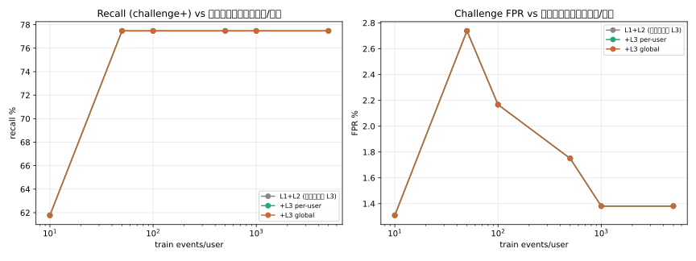

# Learning Curve 4 ชั้นครบ — per-user profile (10→5000 แถว/คน)

**วันที่:** 25 ส.ค. 2026  

**ข้อมูล:** 12 โปรไฟล์ · train_pool≤5000 | val 700 | **test 700/คน ตรึงทุกรอบ**
+ attack 293 (53 subtle) = 3.4% ของ test

**Pipeline:** L1 rule + L2 behavior(Tier1+2) + L3 IForest + L4 aggregate — 4 ชั้นจริง

**Methodology:** test observations ตรึง (feature vector คงที่) → curve วัดการเรียนรู้ per-user profile(L2)+IForest(L3) ล้วนๆ · val calibrate L3 threshold (FPR budget 5%)

## ผลแยกตาม config

### L1+L2 (ไม่มี L3)

| size | recall | obvious | subtle(warn+) | cFPR | wFPR | precision | policy |
|---|---|---|---|---|---|---|---|
| 10 | 62% | 75% | 4% | 1.3% | 1.3% | 62% | 62% |
| 50 | 77% | 85% | 57% | 2.7% | 4.8% | 50% | 84% |
| 100 | 77% | 85% | 57% | 2.2% | 3.9% | 56% | 84% |
| 500 | 77% | 85% | 57% | 1.8% | 2.9% | 61% | 84% |
| 1000 | 77% | 85% | 57% | 1.4% | 2.5% | 66% | 84% |
| 5000 | 77% | 85% | 57% | 1.4% | 2.8% | 66% | 84% |

### +L3 per-user

| size | recall | obvious | subtle(warn+) | cFPR | wFPR | precision | policy |
|---|---|---|---|---|---|---|---|
| 10 | 62% | 75% | 4% | 1.3% | 1.3% | 62% | 62% |
| 50 | 77% | 85% | 57% | 2.7% | 4.8% | 50% | 84% |
| 100 | 77% | 85% | 57% | 2.2% | 3.9% | 56% | 84% |
| 500 | 77% | 85% | 57% | 1.8% | 2.9% | 61% | 84% |
| 1000 | 77% | 85% | 57% | 1.4% | 2.5% | 66% | 84% |
| 5000 | 77% | 85% | 57% | 1.4% | 2.8% | 66% | 84% |

### +L3 global

| size | recall | obvious | subtle(warn+) | cFPR | wFPR | precision | policy |
|---|---|---|---|---|---|---|---|
| 10 | 62% | 75% | 4% | 1.3% | 1.3% | 62% | 62% |
| 50 | 77% | 85% | 57% | 2.7% | 4.8% | 50% | 84% |
| 100 | 77% | 85% | 57% | 2.2% | 3.9% | 56% | 84% |
| 500 | 77% | 85% | 57% | 1.8% | 2.9% | 61% | 84% |
| 1000 | 77% | 85% | 57% | 1.4% | 2.5% | 66% | 84% |
| 5000 | 77% | 85% | 57% | 1.4% | 2.8% | 66% | 84% |

